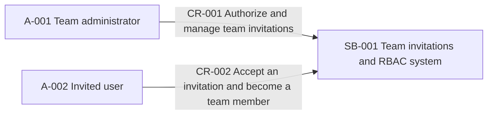
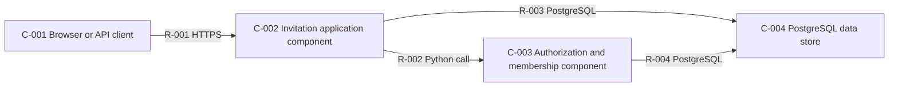
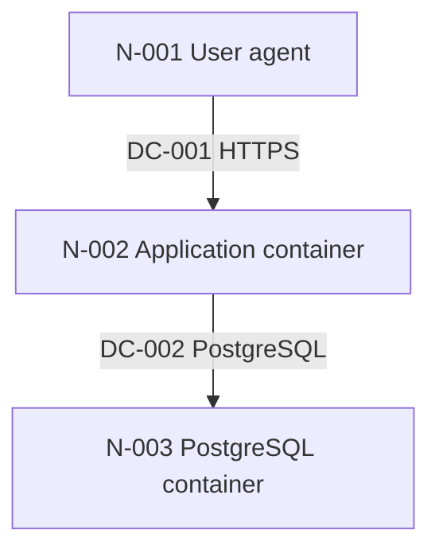
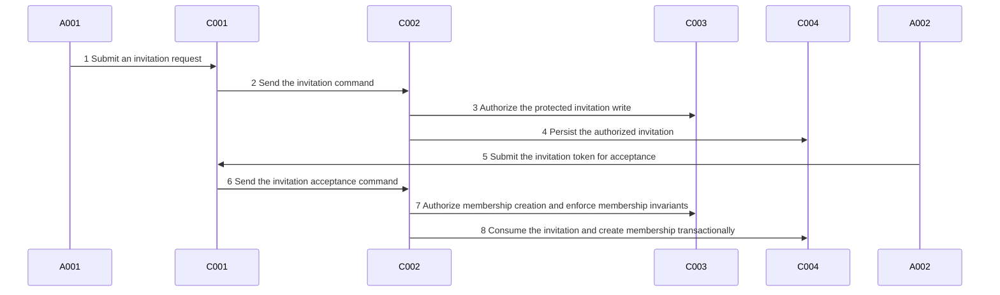

# Architecture Views: team-invitations-rbac

> Generated projection. Tables and Mermaid are derived from `architecture.json`.

## System Context

| Boundary | Name | Responsibility | In scope | Out of scope | Evidence state | Evidence |
|---|---|---|---|---|---|---|
| SB-001 | Team invitations and RBAC system | Authorize team operations and manage invitation and membership lifecycle within the written plan. | Role and authorization foundation; Invitation creation, listing, acceptance, and membership creation | Email delivery; Production deployment topology selection | recorded | `docs/briefs/team-invitations-rbac.md`, `docs/plans/team-invitations-rbac/feature-plan.md` |

| Actor | Name | Kind | Roles | Features | Evidence state | Evidence |
|---|---|---|---|---|---|---|
| A-001 | Team administrator | role | Create and list team invitations; Choose an existing team role for an invitee | 01-roles-authz-foundation, 02-team-invitations | recorded | `docs/briefs/team-invitations-rbac.md`, `docs/plans/team-invitations-rbac/feature-plan.md` |
| A-002 | Invited user | role | Accept an invitation token and become a team member | 02-team-invitations | recorded | `docs/briefs/team-invitations-rbac.md`, `docs/plans/team-invitations-rbac/feature-plan.md` |

| Context relationship | From | To | Interaction | Features | Evidence state | Evidence |
|---|---|---|---|---|---|---|
| CR-001 | A-001 | SB-001 | Authorize and manage team invitations | 01-roles-authz-foundation, 02-team-invitations | recorded | `docs/plans/team-invitations-rbac/feature-plan.md` |
| CR-002 | A-002 | SB-001 | Accept an invitation and become a team member | 02-team-invitations | recorded | `docs/plans/team-invitations-rbac/feature-plan.md` |

## Runtime / Container View

| Component | Name | Kind | Responsibilities | Owner | Features | Evidence state | Evidence |
|---|---|---|---|---|---|---|---|
| C-001 | Browser or API client | user-interface | Submit invitation and acceptance requests and present explicit outcomes | calling client | 02-team-invitations | recorded | `docs/briefs/team-invitations-rbac.md`, `docs/plans/team-invitations-rbac/shared-context.md` |
| C-002 | Invitation application component | service | Coordinate invitation creation, listing, token validation, and acceptance; Invoke authorization before protected persistence | application team | 01-roles-authz-foundation, 02-team-invitations | inferred | `src/invitations.py`, `docs/adr/0001-single-service-runtime.md`, `docs/plans/team-invitations-rbac/feature-plan.md` |
| C-003 | Authorization and membership component | service | Evaluate team capabilities; Own membership invariants and authorization-before-write behavior | application team | 01-roles-authz-foundation, 02-team-invitations | recorded | `src/auth.py`, `docs/plans/team-invitations-rbac/features/01-roles-authz-foundation.md` |
| C-004 | PostgreSQL data store | data-store | Persist invitation and membership records as the source of truth; Enforce transactional and uniqueness constraints | application data owner | 01-roles-authz-foundation, 02-team-invitations | observed | `deploy/compose.yaml`, `docs/plans/team-invitations-rbac/feature-plan.md` |

| Relationship | From | To | Interaction | Protocol | Mode | Contract realizations | Features | Evidence state | Evidence |
|---|---|---|---|---|---|---|---|---|---|
| R-001 | C-001 | C-002 | Submit authenticated invitation and acceptance requests | HTTPS | synchronous | — | 02-team-invitations | recorded | `docs/plans/team-invitations-rbac/shared-context.md` |
| R-002 | C-002 | C-003 | Evaluate authorization and coordinate membership behavior | Python call | in-process | — | 01-roles-authz-foundation, 02-team-invitations | recorded | `docs/plans/team-invitations-rbac/feature-plan.md`, `docs/adr/0001-single-service-runtime.md` |
| R-003 | C-002 | C-004 | Persist and read invitation state within the acceptance transaction | PostgreSQL | data-access | CTR-001 | 01-roles-authz-foundation, 02-team-invitations | inferred | `docs/plans/team-invitations-rbac/interaction-contract.md`, `deploy/compose.yaml` |
| R-004 | C-003 | C-004 | Read and write membership state with uniqueness enforcement | PostgreSQL | data-access | CTR-001 | 01-roles-authz-foundation, 02-team-invitations | inferred | `docs/plans/team-invitations-rbac/interaction-contract.md`, `deploy/compose.yaml` |

## Deployment View

| Node | Name | Environment | Provider / runtime | Region / zones | Network zone | Residency | Scaling / availability | Trust boundaries | Features | Evidence state | Evidence selectors | Evidence |
|---|---|---|---|---|---|---|---|---|---|---|---|---|
| N-001 | User agent | client environment | user-managed client environment / browser or API client | unknown / unknown | unknown | unknown | unknown / unknown | TB-001 | 02-team-invitations | recorded | name=docs/briefs/team-invitations-rbac.md :: recipient accepts the invitation → User agent; environment=docs/briefs/team-invitations-rbac.md :: notification adapter → client environment | `docs/briefs/team-invitations-rbac.md` |
| N-002 | Application container | local-compose | Docker Compose / Python 3.13 application container | unknown / unknown | unknown | unknown | unknown / unknown | TB-001 | 01-roles-authz-foundation, 02-team-invitations | observed | name=Dockerfile :: FROM python:3.13-slim → Application container; environment=deploy/compose.yaml :: services: → local-compose; provider=deploy/compose.yaml :: services: → Docker Compose; runtime=Dockerfile :: FROM python:3.13-slim → Python 3.13 application container | `Dockerfile`, `deploy/compose.yaml` |
| N-003 | PostgreSQL container | local-compose | Docker Compose / PostgreSQL 17 container | unknown / unknown | unknown | unknown | unknown / unknown | — | 01-roles-authz-foundation, 02-team-invitations | observed | name=deploy/compose.yaml :: image: postgres:17 → PostgreSQL container; environment=deploy/compose.yaml :: services: → local-compose; provider=deploy/compose.yaml :: services: → Docker Compose; runtime=deploy/compose.yaml :: image: postgres:17 → PostgreSQL 17 container | `deploy/compose.yaml` |

| Deployment | Component | Nodes | Replica strategy | Scaling | Failover | Features | Evidence state | Evidence |
|---|---|---|---|---|---|---|---|---|
| DP-001 | C-001 | N-001 | Client instances are caller-managed; production expectations are tracked by GAP-001. | Client concurrency is outside the deployable application boundary. | Caller retry is bounded by the interaction contract and explicit API outcomes. | 02-team-invitations | inferred | `docs/briefs/team-invitations-rbac.md` |
| DP-002 | C-002 | N-002 | The fixture records one local application service; production replica strategy is tracked by GAP-001. | Production application scaling is not recorded and is tracked by GAP-001. | Production application failover is not recorded and is tracked by GAP-001. | 01-roles-authz-foundation, 02-team-invitations | observed | `Dockerfile`, `deploy/compose.yaml` |
| DP-003 | C-003 | N-002 | Authorization shares the application placement and its GAP-001 production replica decision. | Authorization scales with the application placement under the future production topology. | Authorization shares the application failure domain until a new plan and ADR change it. | 01-roles-authz-foundation, 02-team-invitations | inferred | `docs/adr/0001-single-service-runtime.md`, `Dockerfile` |
| DP-004 | C-004 | N-003 | The fixture records one local database service; production replica strategy is tracked by GAP-001. | Production database scaling is not recorded and is tracked by GAP-001. | Production database failover is not recorded and is tracked by GAP-001. | 01-roles-authz-foundation, 02-team-invitations | observed | `deploy/compose.yaml` |

| Connection | From node | To node | Direction | Protocol | Purpose | Network boundary | Features | Evidence state | Evidence |
|---|---|---|---|---|---|---|---|---|---|
| DC-001 | N-001 | N-002 | bidirectional | HTTPS | Submit invitation and acceptance requests and receive explicit outcomes | Public client to application boundary; production controls are tracked by GAP-001. | 02-team-invitations | inferred | `docs/plans/team-invitations-rbac/shared-context.md`, `docs/plans/team-invitations-rbac/threat-model.md` |
| DC-002 | N-002 | N-003 | bidirectional | PostgreSQL | Read and write invitation and membership state transactionally | Local Compose application-to-data boundary; production controls are tracked by GAP-001. | 01-roles-authz-foundation, 02-team-invitations | observed | `deploy/compose.yaml` |

## Dynamic Scenarios

### DS-001 — Authorize, create, and accept an invitation

| Journey ref | Features | Evidence state | Evidence |
|---|---|---|---|
| feature-plan.md#journey-map | 01-roles-authz-foundation, 02-team-invitations | inferred | `docs/plans/team-invitations-rbac/feature-plan.md`, `docs/plans/team-invitations-rbac/interaction-contract.md`, `docs/plans/team-invitations-rbac/threat-model.md` |

Trigger: A team administrator invites a person and the recipient later accepts the issued token.

Success outcome: An authorized invitation is persisted and one idempotent acceptance creates exactly one team membership.

| Step | From | To | Interaction | Mode | Integration | Contract realizations | Security realizations | Failure behavior |
|---|---|---|---|---|---|---|---|---|
| 1 | A-001 | C-001 | Submit an invitation request | human | — | — | SR-002 | The client presents an explicit validation or authorization failure. |
| 2 | C-001 | C-002 | Send the invitation command | synchronous | IF-001 | — | SR-002 | An HTTP failure returns without implying invitation creation. |
| 3 | C-002 | C-003 | Authorize the protected invitation write | in-process | IF-002 | — | SR-001, SR-002 | A denial stops the scenario before persistence. |
| 4 | C-002 | C-004 | Persist the authorized invitation | data-access | IF-003 | CTR-001 | SR-001, SR-002 | The transaction rolls back and the caller receives an explicit failure. |
| 5 | A-002 | C-001 | Submit the invitation token for acceptance | human | — | CTR-001 | SR-002 | An invalid token produces an explicit failure without membership creation. |
| 6 | C-001 | C-002 | Send the invitation acceptance command | synchronous | IF-001 | CTR-001 | SR-002 | The response distinguishes failure from an accepted result. |
| 7 | C-002 | C-003 | Authorize membership creation and enforce membership invariants | in-process | IF-002 | CTR-001 | SR-001, SR-002 | A denial or membership-invariant failure stops acceptance before persistence. |
| 8 | C-002 | C-004 | Consume the invitation and create membership transactionally | data-access | IF-003 | CTR-001 | SR-001, SR-002 | Rollback preserves the prior durable state; replay returns the existing membership. |

| Alternate path | Condition | Outcome | Steps |
|---|---|---|---|
| Authorization denied | The caller lacks the authorization required for the attempted invitation or membership write. | Return denial and create no invitation or membership. | 3, 7 |
| Acceptance replay | The invitation token was already accepted. | Return the existing membership without creating a duplicate. | 8 |

## Transition Architecture

| Transition | Name | From | To | Strategy | Coexistence | Compatibility | Cutover | Rollback | Data migration | Owner | Components / data / deployments | Decisions | Features | Evidence state | Evidence |
|---|---|---|---|---|---|---|---|---|---|---|---|---|---|---|---|

## View Coverage Gaps

| Gap | Dimension | Type | Statement | Status |
|---|---|---|---|---|
| GAP-001 | deployment | topology | Production provider, region, zones, network zones, residency, scaling, availability, replica, and failover topology are not recorded. | open |
