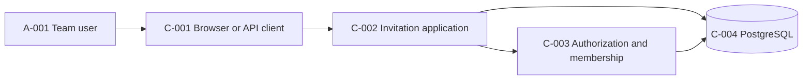
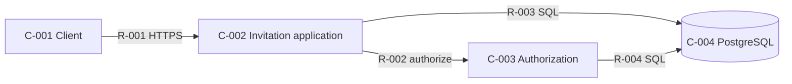
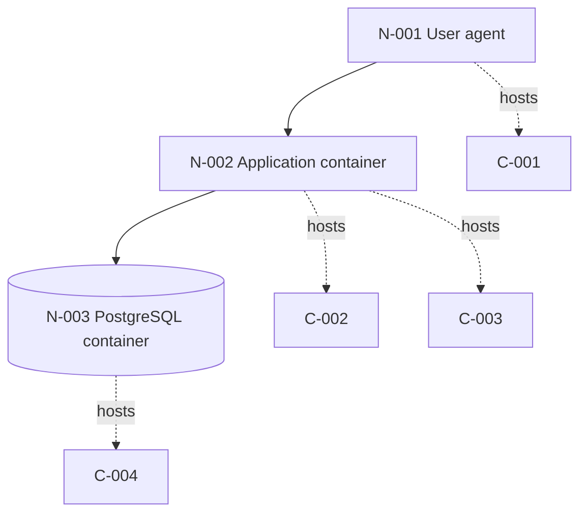

# Architecture Views: team-invitations-rbac

> Tables are authoritative. Mermaid diagrams are projections.

## System Context

| ID | Element | Kind | Responsibility | Evidence state | Evidence |
|---|---|---|---|---|---|
| A-001 | Team administrator or invited user | actor | Creates/lists invitations or accepts one invitation | recorded | `feature-plan.md#journey-map` |
| C-001 | Browser or API client | user-interface | Presents invitation actions and carries the caller's credentials or token | recorded | `feature-plan.md#journey-map` |
| C-002 | Invitation application component | service | Coordinates create, list, and accept workflows | inferred | `features/02-team-invitations.md` |
| C-003 | Authorization and membership component | service | Evaluates team capabilities and owns membership rules | recorded | `features/01-roles-authz-foundation.md` |
| C-004 | PostgreSQL data store | data-store | Stores invitations and memberships as the source of truth | observed | `shared-context.md`, `deploy/compose.yaml` |

## Runtime / Container View

| Component | Name | Kind | Responsibilities | Features | Evidence state | Evidence |
|---|---|---|---|---|---|---|
| C-001 | Browser or API client | user-interface | Send invitation and acceptance requests and render explicit outcomes | 02-team-invitations | recorded | `docs/plans/team-invitations-rbac/feature-plan.md` |
| C-002 | Invitation application component | service | Coordinate invitation creation, listing, and acceptance | 01-roles-authz-foundation, 02-team-invitations | inferred | `src/invitations.py`, `docs/adr/0001-single-service-runtime.md` |
| C-003 | Authorization and membership component | service | Evaluate capabilities and own membership invariants | 01-roles-authz-foundation, 02-team-invitations | recorded | `src/auth.py`, `docs/plans/team-invitations-rbac/features/01-roles-authz-foundation.md` |
| C-004 | PostgreSQL data store | data-store | Persist invitation and membership records as the source of truth | 01-roles-authz-foundation, 02-team-invitations | observed | `deploy/compose.yaml`, `docs/plans/team-invitations-rbac/feature-plan.md` |

| Relationship | From | To | Interaction | Evidence state | Evidence |
|---|---|---|---|---|---|
| R-001 | C-001 | C-002 | Authenticated HTTPS invitation API | recorded | `docs/plans/team-invitations-rbac/threat-model.md` |
| R-002 | C-002 | C-003 | In-process authorization and membership call | recorded | `docs/plans/team-invitations-rbac/feature-plan.md` |
| R-003 | C-002 | C-004 | PostgreSQL invitation transaction | inferred | `docs/plans/team-invitations-rbac/interaction-contract.md` |
| R-004 | C-003 | C-004 | PostgreSQL membership read and write | inferred | `docs/plans/team-invitations-rbac/interaction-contract.md` |

## Deployment View

| Node | Name | Environment | Name selector | Environment selector | Evidence state | Evidence |
|---|---|---|---|---|---|---|
| N-001 | User agent | client | docs/briefs/team-invitations-rbac.md :: recipient accepts the invitation | docs/briefs/team-invitations-rbac.md :: notification adapter | recorded | `docs/briefs/team-invitations-rbac.md` |
| N-002 | Application container | local-compose | Dockerfile :: FROM python:3.13-slim | deploy/compose.yaml :: services: | observed | `Dockerfile`, `deploy/compose.yaml` |
| N-003 | PostgreSQL container | local-compose | deploy/compose.yaml :: image: postgres:17 | deploy/compose.yaml :: services: | observed | `deploy/compose.yaml` |

| Component | Deployed to | Evidence state | Evidence |
|---|---|---|---|
| C-001 | N-001 | inferred | `docs/briefs/team-invitations-rbac.md` |
| C-002 | N-002 | inferred | `Dockerfile`, `deploy/compose.yaml` |
| C-003 | N-002 | inferred | `docs/adr/0001-single-service-runtime.md`, `Dockerfile` |
| C-004 | N-003 | observed | `deploy/compose.yaml` |

## View Coverage Gaps

None relative to the recorded plan. Cloud region, autoscaling, and a notification adapter
are not inferred because they are not part of the approved scope.
