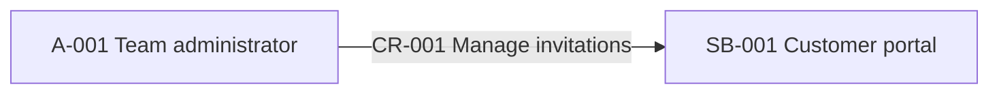
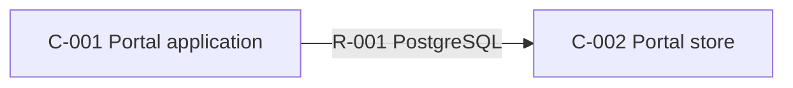
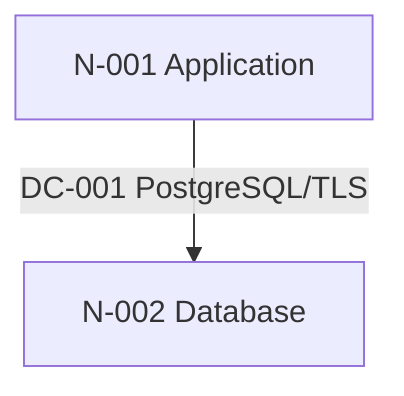
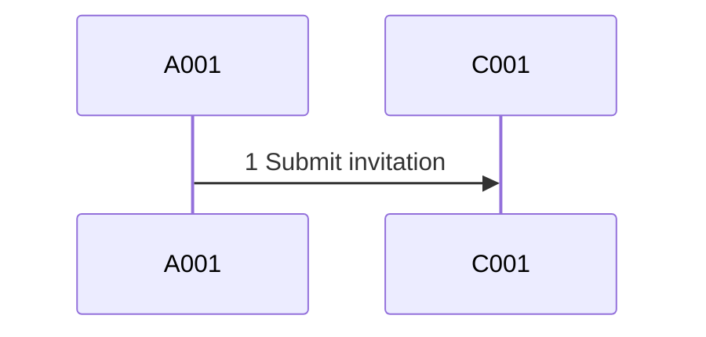

# Solution Architecture — Artifact Contract

Load this file only during Stage 2 modeling and Stage 4 assembly. In schema v2,
`architecture.json` is the sole authored semantic source. The four required
Markdown files and every Mermaid block are deterministic projections generated
from that JSON. Do not hand-author a second narrative source, invent alternate
fields, or add another projection.

## Directory

```text
docs/plans/<slug>/architecture/
├── solution-architecture.md
├── views.md
├── data-and-integrations.md
├── quality-attributes.md
└── architecture.json
```

These five regular files are the exact schema-v2 package. Additional entries,
symlinks, alternate renderer types, and arbitrary Markdown extras fail the
package. Broader projection registration requires a future schema revision.

## `architecture.json` v2

### Strictness and ordering

The document uses:

```json
{
  "$schema": "urn:vg-sdlc:ce-architecture:architecture:v2",
  "schema_version": 2,
  "generator": {
    "name": "/core-engineering:ce-architecture",
    "version": "<core-engineering plugin manifest version>"
  }
}
```

Every object uses only the keys defined below. Every required key is present,
even when its value is an empty array, empty object, or permitted `null`.
`revision_reset` is the sole conditional top-level recovery key. `extensions`
is the sole extensibility point: its keys must be reverse-DNS names and its
values must be JSON objects. Extensions cannot replace, weaken, or change the
meaning of a required field.

Top-level keys occur in this order:

```text
$schema
schema_version
generator
project_slug
lifecycle_status
baseline_status
architecture_revision
source_plan_revision
source_plan_path
sources
projections
coverage_profile
coverage
readiness
narrative
drivers
actors
system_boundary
context_relationships
components
relationships
deployment_nodes
deployments
deployment_connections
data_entities
integration_flows
dynamic_scenarios
trust_boundaries
security_realizations
contract_realizations
transitions
quality_scenarios
operations
direction_realizations
feature_mappings
decisions
open_questions
risks
gaps
revision_reset (only when the recovery contract permits it)
approval
extensions
```

Arrays are ordered by numeric id, except:

- `sources`, which are ordered by repository-relative path;
- `projections`, whose exact four required rows use the order below;
- `dynamic_scenarios.steps`, which are ordered by `ordinal`;
- selected-direction commitments, whose `ordinal` is their one-based position
  in the selected option dimension; and
- string id arrays, which preserve the order of the referenced canonical
  collection.

Duplicate ids, duplicate references, unknown keys, unresolved references, and
placeholder values fail lint.

### Identity, lifecycle, projections, coverage, and readiness

Use this exact shape:

```json
{
  "$schema": "urn:vg-sdlc:ce-architecture:architecture:v2",
  "schema_version": 2,
  "generator": {
    "name": "/core-engineering:ce-architecture",
    "version": "0.10.7"
  },
  "project_slug": "customer-portal",
  "lifecycle_status": "proposed",
  "baseline_status": "accepted-for-specification-with-gaps",
  "architecture_revision": 1,
  "source_plan_revision": 1,
  "source_plan_path": "docs/plans/customer-portal",
  "sources": [
    {
      "path": "docs/plans/customer-portal/plan.json",
      "sha256": "<64 lowercase hex>",
      "kind": "plan"
    }
  ],
  "projections": [
    {
      "id": "PROJ-001",
      "projection_type": "solution-architecture",
      "path": "solution-architecture.md",
      "required": true,
      "sha256": "<64 lowercase hex>"
    },
    {
      "id": "PROJ-002",
      "projection_type": "architecture-views",
      "path": "views.md",
      "required": true,
      "sha256": "<64 lowercase hex>"
    },
    {
      "id": "PROJ-003",
      "projection_type": "data-and-integrations",
      "path": "data-and-integrations.md",
      "required": true,
      "sha256": "<64 lowercase hex>"
    },
    {
      "id": "PROJ-004",
      "projection_type": "quality-attributes",
      "path": "quality-attributes.md",
      "required": true,
      "sha256": "<64 lowercase hex>"
    }
  ],
  "coverage_profile": {
    "profile_id": "solution-baseline-v2",
    "trigger_ids": [
      "trust-residency-or-sensitive-boundary"
    ],
    "required_dimensions": [
      "direction_realization",
      "system_context",
      "containers",
      "security",
      "requirements_traceability"
    ]
  },
  "coverage": {
    "direction_realization": {
      "status": "complete",
      "gap_ids": [],
      "evidence": ["docs/plans/customer-portal/architecture-selection.json"]
    },
    "system_context": {
      "status": "complete",
      "gap_ids": [],
      "evidence": ["docs/plans/customer-portal/feature-plan.md"]
    },
    "containers": {
      "status": "complete",
      "gap_ids": [],
      "evidence": ["docs/plans/customer-portal/feature-plan.md"]
    },
    "deployment": {
      "status": "gap",
      "gap_ids": ["GAP-001"],
      "evidence": ["deploy/production.yaml"]
    },
    "data": {
      "status": "complete",
      "gap_ids": [],
      "evidence": ["docs/plans/customer-portal/feature-plan.md"]
    },
    "integrations": {
      "status": "complete",
      "gap_ids": [],
      "evidence": ["docs/plans/customer-portal/interaction-contract.md"]
    },
    "dynamic_behavior": {
      "status": "complete",
      "gap_ids": [],
      "evidence": ["docs/plans/customer-portal/feature-plan.md"]
    },
    "security": {
      "status": "complete",
      "gap_ids": [],
      "evidence": ["docs/plans/customer-portal/threat-model.md"]
    },
    "contracts": {
      "status": "complete",
      "gap_ids": [],
      "evidence": ["docs/plans/customer-portal/interaction-contract.md"]
    },
    "transitions": {
      "status": "not-applicable",
      "gap_ids": [],
      "evidence": ["docs/plans/customer-portal/architecture-selection.json"]
    },
    "quality_attributes": {
      "status": "complete",
      "gap_ids": [],
      "evidence": ["docs/briefs/customer-portal.md"]
    },
    "operability": {
      "status": "gap",
      "gap_ids": ["GAP-002"],
      "evidence": ["docs/plans/customer-portal/shared-context.md"]
    },
    "requirements_traceability": {
      "status": "complete",
      "gap_ids": [],
      "evidence": ["docs/plans/customer-portal/plan.json"]
    }
  },
  "readiness": {
    "status": "ready-with-gaps",
    "blocking_gap_ids": [],
    "non_blocking_gap_ids": ["GAP-001", "GAP-002"],
    "summary": "The baseline is reviewable for specification; region and alert ownership remain explicit downstream constraints."
  }
}
```

`lifecycle_status` is `proposed` in scratch and `published` after the publisher
completes. `baseline_status` is the human decision the package is seeking or
has received: `accepted-for-specification` or
`accepted-for-specification-with-gaps`. It is fixed before review, appears in
the Markdown banner, and does not change during publication.

`readiness.status` is `ready`, `ready-with-gaps`, or `blocked`; it is a computed
architecture readiness result, not an approval. `ready` requires no open gaps.
`ready-with-gaps` permits only open, non-material gaps that do not block
specification. `blocked` is mandatory when a material gap, specification-stage
gap, unresolved material question, selected-direction conflict, or missing
required dimension remains. A blocked package cannot be published.

Every one of these coverage keys is present:

```text
direction_realization
system_context
containers
deployment
data
integrations
dynamic_behavior
security
contracts
transitions
quality_attributes
operability
requirements_traceability
```

A coverage row is exactly `{status, gap_ids, evidence}`. `status` is
`complete`, `gap`, or `not-applicable`. A `gap` row references at least one open
typed gap in the same dimension. `complete` and `not-applicable` use an empty
`gap_ids`. A required dimension cannot be `not-applicable`.

`coverage_profile.trigger_ids` exactly copies the lint-validated plan trigger
ids. `required_dimensions` is the resolved union of the always-required
dimensions and the conditional matrix below:

| Plan trigger or selected commitment | Additional required dimension / collection |
|---|---|
| Every baseline | `direction_realization`, `system_context`, `containers`, `requirements_traceability` |
| `explicit-architecture-deliverable` | every dimension positively applicable from the validated plan and exact selected commitments; it never overrides an explicit absence commitment |
| `multi-runtime-or-deployment-boundary` | `deployment`; nodes, placements, and cross-node connections |
| `cross-feature-durable-or-async-flow` | `integrations`, `dynamic_behavior`, and `data` when durable state is carried |
| `shared-data-ownership-or-migration` | `data`; `transitions` only when an exact selected migration/evolution commitment does not match the anchored explicit-absence classifier, plus a dynamic migration scenario when ordering matters |
| `trust-residency-or-sensitive-boundary` | `security`; trust boundaries and one realization per `TZ-NNN` |
| `shared-protocol-or-schema` | `integrations`, `contracts`; one realization per `IC-NNN` |
| `platform-or-topology-choice` | `deployment` and the accepted topology decision |
| `architecture-determining-nfr` | `quality_attributes` and the applicable `operations` categories |
| `contested-cross-feature-owner` | explicit component/data/operation ownership and an accepted decision |
| Any exact selected `migration_and_evolution` commitment that does not match the anchored explicit-absence classifier | `transitions`, regardless of trigger drift |
| Every exact selected `migration_and_evolution` commitment matches the anchored explicit-absence classifier | `transitions` is omitted from `required_dimensions`, coverage is `not-applicable`, `transitions` is empty, and each absence commitment has a `not-applicable` direction realization |
| Any journey crossing multiple components or an async boundary | `dynamic_behavior`, regardless of trigger drift |

The plan remains authoritative. The profile may expose inconsistent trigger
classification but cannot silently add a plan trigger; a mismatch routes to
planning. The transition-absence classifier is anchored to an unambiguous
no-current-transition or no-current-migration commitment in the first clause
(before `;`, `,`, `:`, or `.`) and fails closed. It accepts exact `none` or
`not applicable`; subject-focused `no ...`, `... is/are not ...`, `... is/are
absent`, and `without a/any ...` forms for `migration`, `transition`, `cutover`,
`data movement`, or `ownership transfer`. Safe scope modifiers are `current`,
`runtime`, `data`, `schema`, `state`, and `ownership` (including `or`
combinations); accepted predicates are `introduced`, `required`, `planned`,
`needed`, `applicable`, `performed`, or `undertaken`. Incidental modifiers such
as downtime, outage, interruption, or data loss do not qualify: `migration with
no downtime`, `migrate without downtime`, and `no downtime migration` all
remain transition-required. Ambiguous wording also remains
transition-required.

### Canonical narrative inputs

All prose used by the four required projections lives in this exact object:

```json
{
  "narrative": {
    "executive_summary": "<short solution-level summary>",
    "scope": ["<architecture-level in-scope statement>"],
    "non_goals": ["<explicit non-goal>"],
    "architecture_overview": "<short structural synthesis>",
    "assumptions": [
      {
        "id": "AS-001",
        "statement": "<bounded assumption>",
        "evidence_state": "inferred",
        "evidence": ["docs/plans/customer-portal/shared-context.md"]
      }
    ],
    "validation_strategy": [
      {
        "id": "VAL-001",
        "statement": "<architecture verification route>",
        "owner": "<workflow or role>",
        "evidence_state": "recorded",
        "evidence": ["docs/plans/customer-portal/plan.json"]
      }
    ],
    "evidence_boundary": "<what was and was not examined>",
    "consistency_model": "<solution-level consistency, idempotency, and concurrency summary>",
    "security_privacy_summary": "<re-projection summary; never security acceptance>",
    "operability_summary": "<solution-level ownership and observability summary>",
    "capacity_resilience_recovery_summary": "<source-backed capacity, resilience, and recovery summary>",
    "cost_complexity_summary": "<accepted solution-level cost and complexity trade-off>"
  }
}
```

These are short synthesis fields, not feature bodies, endpoint payloads, full
threat tables, test plans, or ADR copies. Detailed flow and quality prose stays
with the corresponding structured row through `details`.

### Context and drivers

Rows use these exact shapes:

```json
{
  "drivers": [
    {
      "id": "DRV-001",
      "name": "Central authorization",
      "statement": "Protected invitation writes require central authorization.",
      "source": "docs/plans/customer-portal/threat-model.md",
      "consequence": "The authorization responsibility is crossed before persistence.",
      "feature_ids": ["01-identity-foundation", "02-dashboard"],
      "evidence_state": "recorded",
      "evidence": ["docs/plans/customer-portal/threat-model.md"]
    }
  ],
  "actors": [
    {
      "id": "A-001",
      "name": "Team administrator",
      "kind": "role",
      "roles": ["Create and list invitations"],
      "feature_ids": ["02-dashboard"],
      "evidence_state": "recorded",
      "evidence": ["docs/plans/customer-portal/feature-plan.md"]
    }
  ],
  "system_boundary": {
    "id": "SB-001",
    "name": "Customer portal",
    "responsibility": "Serve the written plan's customer-portal journeys.",
    "in_scope": ["Invitation authorization and lifecycle"],
    "out_of_scope": ["Email-provider implementation"],
    "evidence_state": "recorded",
    "evidence": ["docs/plans/customer-portal/feature-plan.md"]
  },
  "context_relationships": [
    {
      "id": "CR-001",
      "from": "A-001",
      "to": "SB-001",
      "interaction": "Manage team invitations",
      "feature_ids": ["02-dashboard"],
      "evidence_state": "recorded",
      "evidence": ["docs/plans/customer-portal/feature-plan.md"]
    }
  ]
}
```

Actor `kind` is `person`, `role`, `organization`, or `external-system`.
External people and systems belong in `actors`; the solution of interest is the
single `system_boundary`. Context relationship endpoints resolve only to actor
or system-boundary ids. This prevents a context view from silently becoming a
duplicate container view.

### Runtime and deployment

```json
{
  "components": [
    {
      "id": "C-001",
      "name": "Portal application",
      "kind": "service",
      "responsibilities": ["Authorize requests and own invitation state"],
      "owner": "application team",
      "feature_ids": ["01-identity-foundation", "02-dashboard"],
      "evidence_state": "recorded",
      "evidence": ["docs/plans/customer-portal/feature-plan.md"]
    }
  ],
  "relationships": [
    {
      "id": "R-001",
      "from": "C-001",
      "to": "C-002",
      "interaction": "Persist invitation state",
      "protocol": "PostgreSQL",
      "communication_mode": "data-access",
      "contract_realization_ids": ["CTR-001"],
      "feature_ids": ["02-dashboard"],
      "evidence_state": "inferred",
      "evidence": ["docs/plans/customer-portal/interaction-contract.md"]
    }
  ],
  "deployment_nodes": [
    {
      "id": "N-001",
      "name": "Application runtime",
      "environment": "production",
      "provider": "existing managed platform",
      "runtime": "application container",
      "region": "eu-central",
      "zones": ["zone-a", "zone-b"],
      "network_zone": "application-private",
      "residency": "EU",
      "scaling": "horizontal, minimum two replicas",
      "availability": "multi-zone placement",
      "trust_boundary_ids": ["TB-001"],
      "feature_ids": ["01-identity-foundation", "02-dashboard"],
      "evidence_state": "observed",
      "evidence": ["deploy/production.yaml"],
      "evidence_claims": [
        {
          "field": "name",
          "path": "deploy/production.yaml",
          "literal": "kind: Deployment",
          "derivation": "Application runtime"
        },
        {
          "field": "environment",
          "path": "deploy/production.yaml",
          "literal": "environment: production",
          "derivation": "production"
        }
      ]
    }
  ],
  "deployments": [
    {
      "id": "DP-001",
      "component_id": "C-001",
      "node_ids": ["N-001"],
      "replica_strategy": "minimum two replicas",
      "scaling": "horizontal from observed deployment policy",
      "failover": "platform reschedules a failed replica across recorded zones",
      "feature_ids": ["01-identity-foundation", "02-dashboard"],
      "evidence_state": "observed",
      "evidence": ["deploy/production.yaml"]
    }
  ],
  "deployment_connections": [
    {
      "id": "DC-001",
      "from_node": "N-001",
      "to_node": "N-002",
      "direction": "bidirectional",
      "protocol": "PostgreSQL/TLS",
      "purpose": "Read and write portal state",
      "network_boundary": "application-private to data-private",
      "feature_ids": ["01-identity-foundation", "02-dashboard"],
      "evidence_state": "observed",
      "evidence": ["deploy/production.yaml"]
    }
  ]
}
```

Component `kind` is `user-interface`, `service`, `worker`, `data-store`,
`external-system`, or `platform`. Relationship `communication_mode` is
`synchronous`, `asynchronous`, `in-process`, `data-access`, or `human`.
Deployment-connection `direction` is `one-way` or `bidirectional`.

Do not guess a provider, runtime, region, zones, network zone, residency,
scaling, availability, replica strategy, or failover behavior. Use the literal
`unknown`, attach the owning typed gap, and set the affected coverage/readiness
posture. `evidence_claims` is an ordered array of exact
`{field,path,literal,derivation}` selectors. Each selector path is already in
the row evidence and its literal occurs in that source. The linter proves
occurrence and exact derivation, not semantic entailment; the human reviews the
interpretation.

### Data, integrations, dynamic behavior, security, and contracts

```json
{
  "data_entities": [
    {
      "id": "DATA-001",
      "name": "invitation",
      "data_class": "personal",
      "source_of_truth": "C-002",
      "writers": ["C-001"],
      "readers": ["C-001", "C-002"],
      "lifecycle": {
        "retain": "owned-by:02-dashboard",
        "export": "owned-by:02-dashboard",
        "erase": "owned-by:02-dashboard"
      },
      "consistency": "Invitation consumption and membership creation are transactional.",
      "storage": "existing relational store",
      "region_residency": "EU",
      "backup_recovery": "existing managed database policy; exact RPO is GAP-003",
      "transition_ids": [],
      "plan_trace": "feature-plan.md#durable-state-closure",
      "feature_ids": ["02-dashboard"],
      "evidence_state": "recorded",
      "evidence": ["docs/plans/customer-portal/feature-plan.md"]
    }
  ],
  "integration_flows": [
    {
      "id": "IF-001",
      "name": "Invitation command",
      "producer": "C-001",
      "consumer": "C-002",
      "protocol": "HTTPS",
      "communication_mode": "synchronous",
      "data": ["invitation command"],
      "data_entity_ids": ["DATA-001"],
      "source_of_truth": "C-002",
      "failure_behavior": "The caller receives an explicit failure; no success is implied.",
      "timeout_retry": "Caller retry follows IC-001 idempotency behavior.",
      "contract_realization_ids": ["CTR-001"],
      "security_realization_ids": ["SR-001"],
      "plan_trace": "feature-plan.md#dependency-flow",
      "feature_ids": ["02-dashboard"],
      "details": "The public request is authorized before the invitation write.",
      "evidence_state": "recorded",
      "evidence": ["docs/plans/customer-portal/interaction-contract.md"]
    }
  ],
  "dynamic_scenarios": [
    {
      "id": "DS-001",
      "name": "Create invitation",
      "journey_ref": "feature-plan.md#journey-map",
      "trigger": "An administrator submits a valid invitation.",
      "success_outcome": "An authorized invitation is persisted and acknowledged.",
      "steps": [
        {
          "ordinal": 1,
          "from": "A-001",
          "to": "C-001",
          "interaction": "Submit invitation",
          "communication_mode": "synchronous",
          "integration_id": "IF-001",
          "contract_realization_ids": ["CTR-001"],
          "security_realization_ids": ["SR-001"],
          "failure_behavior": "Return an explicit authorization or validation failure."
        }
      ],
      "alternate_paths": [
        {
          "name": "Authorization denied",
          "condition": "The caller lacks the required capability.",
          "outcome": "Return denial and perform no invitation write.",
          "step_ordinals": [1]
        }
      ],
      "feature_ids": ["02-dashboard"],
      "evidence_state": "inferred",
      "evidence": ["docs/plans/customer-portal/feature-plan.md"]
    }
  ],
  "trust_boundaries": [
    {
      "id": "TB-001",
      "name": "Public-to-application boundary",
      "boundary_type": "trust",
      "description": "Untrusted caller input crosses into the portal application.",
      "inside_ids": ["C-001"],
      "outside_ids": ["A-001"],
      "crossing_integration_ids": ["IF-001"],
      "residency": "EU processing boundary",
      "feature_ids": ["02-dashboard"],
      "evidence_state": "recorded",
      "evidence": ["docs/plans/customer-portal/threat-model.md"]
    }
  ],
  "security_realizations": [
    {
      "id": "SR-001",
      "obligation_id": "TZ-001",
      "boundary_ids": ["TB-001"],
      "actor_ids": ["A-001"],
      "component_ids": ["C-001"],
      "integration_ids": ["IF-001"],
      "data_ids": ["DATA-001"],
      "tactics": ["Authorize before persistence", "Do not log invitation tokens"],
      "verification": "Automated denial and no-write assertions",
      "feature_ids": ["01-identity-foundation", "02-dashboard"],
      "evidence_state": "inferred",
      "evidence": ["docs/plans/customer-portal/threat-model.md"]
    }
  ],
  "contract_realizations": [
    {
      "id": "CTR-001",
      "obligation_id": "IC-001",
      "relationship_ids": ["R-001"],
      "integration_ids": ["IF-001"],
      "dynamic_scenario_ids": ["DS-001"],
      "data_ids": ["DATA-001"],
      "behavior": "Invitation acceptance is idempotent per token.",
      "failure_behavior": "A replay returns the existing accepted result.",
      "compatibility": "The plan-owned interaction contract remains the authority.",
      "verification": "Replay and concurrency tests after specification",
      "feature_ids": ["01-identity-foundation", "02-dashboard"],
      "evidence_state": "recorded",
      "evidence": ["docs/plans/customer-portal/interaction-contract.md"]
    }
  ]
}
```

Dynamic step ordinals start at one and are contiguous. Step endpoints resolve
to actors, the system boundary, or components. `integration_id` is an
integration id or `null`. Alternate paths refer to existing step ordinals.

For each trust boundary, `crossing_integration_ids` exactly equals the
integration flows whose producer and consumer are explicitly placed on
opposite sides by `inside_ids` and `outside_ids`, preserving canonical flow
order. An endpoint omitted from both sides does not cross that boundary; the
two sides are boundary-local sets, not an exhaustive system partition.

Every plan-owned `TZ-NNN` has exactly one `security_realizations` row and every
plan-owned `IC-NNN` has exactly one `contract_realizations` row when its
dimension is complete. Copy obligation ids; do not invent, merge, or reassign
them. Merely copying an id onto a flow is not a realization. A realization
names the boundary or behavior, affected structural ids, tactic, verification,
features, and evidence. This is architecture design evidence, not security
acceptance or contract implementation proof.

`data_entities` exactly re-projects the plan's Durable-State Closure. Copy each
durable noun's `data_class` and `retain` / `export` / `erase` dispositions
literally, then map architecture-level consistency, storage, residency,
recovery, and transition consequences. `/core-engineering:ce-spec` still owns
schemas, fields, payloads, endpoint definitions, and implementation tests.

### Transition architecture

```json
{
  "transitions": [
    {
      "id": "TR-001",
      "name": "Invitation ownership cutover",
      "from_state": "Invitation records owned by the legacy portal path.",
      "to_state": "Invitation records owned by the selected portal component.",
      "strategy": "Additive transition with explicit ownership transfer.",
      "coexistence": "Old reads remain available during the bounded migration window.",
      "compatibility": "Writers use the accepted interaction contract throughout.",
      "cutover": "Switch the authoritative writer after reconciliation passes.",
      "rollback": "Restore the prior writer before the compatibility window closes.",
      "data_migration": "Backfill and reconcile invitation ownership markers.",
      "owner": "application and data owners",
      "component_ids": ["C-001", "C-002"],
      "data_ids": ["DATA-001"],
      "deployment_ids": ["DP-001"],
      "decision_ids": ["D-001"],
      "feature_ids": ["01-identity-foundation", "02-dashboard"],
      "evidence_state": "inferred",
      "evidence": ["docs/plans/customer-portal/architecture-selection.json"]
    }
  ]
}
```

Any exact selected migration/evolution commitment that does not match the
anchored explicit-absence classifier requires at least one transition. State
coexistence, compatibility, cutover, rollback, data movement, and owner at
solution level. Do not write commands, production runbooks, table schemas, or
deployment instructions here. A matching absence commitment is bound by a
`direction_realizations` row with `realization_status: not-applicable` and a
reviewable statement; keep the transition collection empty rather than
inventing a transition for ceremony.

### Quality and operations

```json
{
  "quality_scenarios": [
    {
      "id": "QA-001",
      "name": "Invitation latency",
      "attribute": "latency",
      "source": "docs/briefs/customer-portal.md",
      "stimulus": "A user submits an invitation.",
      "environment": "normal load",
      "response": "The API confirms acceptance.",
      "target": "p95 under 500 ms",
      "tactic": "Keep the synchronous path bounded.",
      "verification": "/core-engineering:ce-probe-perf against the accepted criterion",
      "operation_ids": ["OP-001"],
      "feature_ids": ["02-dashboard"],
      "details": "The target is a requirement, not measured evidence.",
      "evidence_state": "inferred",
      "evidence": ["docs/briefs/customer-portal.md"]
    }
  ],
  "operations": [
    {
      "id": "OP-001",
      "name": "Invitation request health",
      "category": "observability",
      "responsibility": "Detect invitation-path latency and explicit failures.",
      "owner": "application operations owner",
      "signals": ["request latency", "failure count"],
      "failure_domain": "application request path",
      "target": "Use QA-001 as the latency threshold.",
      "tactic": "Emit correlated metrics without invitation-token values.",
      "runbook": "owned-by:application-operations",
      "verification": "Telemetry contract review during specification and runtime probe after implementation",
      "component_ids": ["C-001"],
      "deployment_node_ids": ["N-001"],
      "quality_ids": ["QA-001"],
      "feature_ids": ["02-dashboard"],
      "evidence_state": "inferred",
      "evidence": ["docs/briefs/customer-portal.md"]
    }
  ]
}
```

Operation `category` is `observability`, `capacity`, `resilience`, `recovery`,
`cost`, or `supportability`. Every architecture-determining NFR in the source
inventory maps to a quality scenario or a typed gap. When operability coverage
is complete, every applicable source requirement also maps to an operation
row. A target is not measured proof. Use the literal `unknown` only with an
open typed gap and the corresponding coverage/readiness posture.

### Selected-direction commitment closure

The selected option's ten ordered arrays remain owned by
`architecture-selection.json`:

```text
responsibilities_and_boundaries
runtime_and_deployment
data_ownership
integrations_and_failure
trust_residency_and_security
quality_tactics
migration_and_evolution
capability_implications
assumptions
irreversible_commitments
```

For every string item in every array, create exactly one row:

```json
{
  "direction_realizations": [
    {
      "id": "DR-001",
      "exploration_id": "AEX-123456789abc",
      "selected_option_id": "A01",
      "selected_option_sha256": "<64 lowercase hex>",
      "dimension": "runtime_and_deployment",
      "ordinal": 1,
      "statement": "Use one application runtime and the existing relational store.",
      "statement_sha256": "<sha256 of the exact UTF-8 statement bytes, with no added newline>",
      "realization_status": "realized",
      "realized_by": [
        {"kind": "component", "id": "C-001"},
        {"kind": "deployment", "id": "DP-001"}
      ],
      "gap_ids": [],
      "evidence_state": "recorded",
      "evidence": ["docs/plans/customer-portal/architecture-selection.json"]
    }
  ]
}
```

The commitment identity is the tuple
`(selected_option_sha256, dimension, ordinal, statement_sha256)`. `ordinal` is
one-based within its dimension; `statement` is copied byte-for-byte before
hashing. The union of rows must be a bijection with all selected option items:
no missing, duplicated, reordered, rewritten, or extra commitment is allowed.

`realization_status` is `realized`, `not-applicable`, or `gap`.
`realized` requires a non-empty `realized_by` and empty `gap_ids`; `gap`
requires at least one typed gap and makes readiness blocked when the commitment
is material; `not-applicable` requires empty references and is valid only when
the exact selected statement explicitly describes an absent commitment.

`realized_by.kind` is one of:

```text
actor
system-boundary
context-relationship
component
relationship
deployment-node
deployment
deployment-connection
data-entity
integration-flow
dynamic-scenario
trust-boundary
security-realization
contract-realization
transition
quality-scenario
operation
decision
risk
```

When the validated direction contains no selected option id/hash,
`direction_realizations` is empty and coverage may be `not-applicable` only for
a plan-lint-approved non-selected direction posture.

### Feature traceability

Create exactly one row per `plan.json` feature:

```json
{
  "feature_mappings": [
    {
      "feature_id": "02-dashboard",
      "mapping_scope": "cross-feature",
      "direction_realization_ids": ["DR-001"],
      "driver_ids": ["DRV-001"],
      "actor_ids": ["A-001"],
      "context_relationship_ids": ["CR-001"],
      "component_ids": ["C-001", "C-002"],
      "relationship_ids": ["R-001"],
      "deployment_node_ids": ["N-001"],
      "deployment_ids": ["DP-001"],
      "deployment_connection_ids": ["DC-001"],
      "data_ids": ["DATA-001"],
      "integration_ids": ["IF-001"],
      "dynamic_scenario_ids": ["DS-001"],
      "trust_boundary_ids": ["TB-001"],
      "security_realization_ids": ["SR-001"],
      "contract_realization_ids": ["CTR-001"],
      "transition_ids": [],
      "quality_ids": ["QA-001"],
      "operation_ids": ["OP-001"],
      "decision_ids": ["D-001"],
      "open_question_ids": [],
      "risk_ids": ["AR-001"],
      "gap_ids": ["GAP-002"],
      "evidence_state": "inferred",
      "evidence": ["docs/plans/customer-portal/feature-plan.md"]
    }
  ]
}
```

`mapping_scope` is `cross-feature` or `feature-local`. A feature-local row still
maps its owning component and every relevant driver, actor, decision, risk,
gap, and quality/operation id. Every structural row's `feature_ids` must equal
the reverse projection from `feature_mappings`.

### Decisions, questions, risks, and typed gaps

```json
{
  "decisions": [
    {
      "id": "D-001",
      "title": "Application runtime",
      "status": "accepted",
      "context": "The plan requires shared authorization and invitation state.",
      "decision": "Use the repository's existing application runtime.",
      "rationale": "It preserves the selected direction without a new network boundary.",
      "alternatives": [
        {
          "option": "Separate invitation service",
          "consequence": "Adds a runtime and trust boundary.",
          "rejection_reason": "No recorded requirement justifies the added commitment."
        }
      ],
      "consequences": ["Authorization and invitations share a deployment blast radius."],
      "reversibility": "A later extraction requires a planned transition.",
      "cost_if_wrong": "Cross-feature runtime and operational rework.",
      "owner": "solution architecture owner",
      "decided_by": "human",
      "decided_at": "2026-07-23T10:00:00Z",
      "adr_path": "docs/adr/0001-application-runtime.md",
      "feature_ids": ["01-identity-foundation", "02-dashboard"],
      "evidence_state": "recorded",
      "evidence": ["docs/adr/0001-application-runtime.md"]
    }
  ],
  "open_questions": [
    {
      "id": "OQ-001",
      "status": "open",
      "question": "Who owns the production alert?",
      "material": false,
      "owner": "operations owner",
      "needed_by": "implementation",
      "options": ["application team", "shared platform team"],
      "related_refs": [{"kind": "operation", "id": "OP-001"}],
      "feature_ids": ["02-dashboard"],
      "evidence_state": "unknown",
      "evidence": ["docs/plans/customer-portal/shared-context.md"]
    }
  ],
  "risks": [
    {
      "id": "AR-001",
      "title": "External provider limits",
      "statement": "External identity-provider limits are unverified.",
      "likelihood": "possible",
      "impact": "Invitation delivery may be throttled.",
      "severity": "medium",
      "owner": "architecture owner",
      "mitigation": "Confirm the provider contract before implementation.",
      "contingency": "Keep delivery behind the accepted adapter boundary.",
      "trigger": "Observed provider limit below the planned demand.",
      "related_refs": [{"kind": "integration-flow", "id": "IF-001"}],
      "feature_ids": ["02-dashboard"],
      "evidence_state": "recorded",
      "evidence": ["docs/briefs/customer-portal.md"]
    }
  ],
  "gaps": [
    {
      "id": "GAP-002",
      "dimension": "operability",
      "gap_type": "ownership",
      "statement": "Production alert ownership is not recorded.",
      "impact": "An alert could lack a responding owner.",
      "material": false,
      "owner": "operations owner",
      "next_action": "Assign the alert owner before implementation.",
      "closure_criteria": "An accepted source names the owner and OP-001 is revised.",
      "blocking_stage": "implementation",
      "status": "open",
      "related_refs": [
        {"kind": "operation", "id": "OP-001"},
        {"kind": "open-question", "id": "OQ-001"}
      ],
      "evidence_state": "unknown",
      "evidence": ["docs/plans/customer-portal/shared-context.md"]
    }
  ]
}
```

`alternatives` rows are exactly `{option, consequence, rejection_reason}`.
`related_refs` rows are exactly `{kind, id}` and use the same kind vocabulary
as `realized_by`, plus `driver`, `actor`, `open-question`, and `gap`.

Decision `status` is `accepted` in a publishable package. `decided_at` and
`adr_path` are strings or `null`; every material ADR-worthy cross-feature
decision has a resolving accepted ADR. Question `status` is `open` or
`resolved`; a material open question blocks readiness. Risk `severity` is
`low`, `medium`, `high`, or `critical`.

Gap `gap_type` is `evidence`, `ownership`, `decision`, `topology`, `behavior`,
`control`, `transition`, `quality-target`, or `other`. `blocking_stage` is
`specification`, `implementation`, `verification`, `deployment`, or `none`.
Gap `status` is `open` or `resolved`. An open material gap or an open gap whose
`blocking_stage` is `specification` forces `readiness.status: blocked` and
cannot be accepted. Every open non-material gap appears in coverage, readiness,
and every affected feature mapping. `accepted-for-specification-with-gaps`
never means the gap is resolved or that downstream stages may ignore its
blocking stage.

### Approval receipt and digest plan

Scratch uses:

```json
{
  "approval": {
    "decision": "pending",
    "recorded_by": "pending",
    "recorded_at": null,
    "authority": null,
    "reference": null,
    "gate": "Final Architecture Approval",
    "review_payload_sha256": "<64 lowercase hex after review normalization>",
    "receipt_sha256": null
  },
  "extensions": {}
}
```

Published approval uses the same exact keys:

```json
{
  "approval": {
    "decision": "accepted-for-specification-with-gaps",
    "recorded_by": "<human identity or recorded role>",
    "recorded_at": "<RFC 3339 UTC timestamp>",
    "authority": "<human solution/technical architecture authority>",
    "reference": "<durable review, ticket, or change-control reference>",
    "gate": "Final Architecture Approval",
    "review_payload_sha256": "<the reviewed payload digest>",
    "receipt_sha256": "<64 lowercase hex approval receipt digest>"
  }
}
```

The bundled renderer/publisher owns canonicalization:

1. Render the four required projections, hash their exact bytes, and populate
   `projections[].sha256`.
2. Canonical JSON is UTF-8 with `ensure_ascii=false`, lexicographically sorted
   keys, compact `,` / `:` separators, and one terminal LF. The digest stream
   begins `architecture.json\0<decimal-byte-length>\0<canonical-json-bytes>`.
   Each projection in manifest order then contributes
   `<UTF-8-path>\0<decimal-byte-length>\0<exact-file-bytes>`.
3. For `review_payload_sha256`, normalize `lifecycle_status` to `proposed` and
   normalize the whole approval object to canonical pending values:
   `decision` and `recorded_by` are `pending`; `recorded_at`, `authority`,
   `reference`, `review_payload_sha256`, and `receipt_sha256` are `null`; `gate`
   remains the fixed gate name. Hash the canonical normalized manifest together
   with the four ordered projection paths and exact bytes.
4. After affirmative approval, the publisher changes only
   `lifecycle_status` and the receipt fields. For `receipt_sha256`, canonicalize
   that published manifest with only `receipt_sha256` set to `null`, then hash
   it with the same ordered projection paths and exact bytes.
5. Consumer lint recomputes both digests and rejects a projection, authority,
   reference, decision, lifecycle, or receipt mismatch.

This binds exactly what the human reviewed while avoiding a self-referential
hash. `approval.decision` must equal `baseline_status` when published.
`authority` records why the human may approve; `reference` records where that
approval can be followed. The reproducible digest is an integrity receipt, not
a cryptographic signature or independent proof of the approver's identity.
Neither field grants security-risk acceptance, compliance attestation, release
approval, or deployment authority.

Only a human-approved recovery from a malformed prior package whose revision is
unreadable adds this strict top-level object immediately before `approval`:

```json
{
  "revision_reset": {
    "reason": "<human-approved non-empty reason>",
    "recorded_by": "human",
    "gate": "Invalid Architecture Package Recovery"
  }
}
```

It is forbidden for a first, current, stale, or readable-revision package.

### Sources and evidence

All repository paths are root-relative. `sources` contains every file whose
change should make the package stale: the six plan-level files, every feature
file, and every consumed brief, ADR, reference, or repository file. Source
`kind` is `plan`, `brief`, `adr`, `repository`, or `reference`.

`evidence_state` is `recorded`, `observed`, `inferred`, or `unknown`.
`recorded` cites approved plan/brief/ADR/reference input; `observed` cites
repository evidence; `inferred` identifies human-reviewed synthesis from named
sources; `unknown` requires an open typed gap. For a structural row, the gap
uses the row's owning coverage dimension and `related_refs` targets that exact
row. Decisions, questions, and risks still require exact-row linkage although
they have no single owning coverage dimension. The same rule applies to any
field or nested list item whose literal value is exactly `unknown`. A path
alone does not establish the evidence state.

## Deterministic Markdown projections

Run the bundled renderer from the completed semantic JSON. The render is
two-pass: render the four required Markdown files without projecting their hash
fields and populate `projections[].sha256`. Prove the package still equals that
deterministic result with:

```bash
python3 "${CLAUDE_SKILL_DIR}/scripts/architecture-render.py" check \
  "<package-dir>" --json
```

The linter runs the same renderer check internally and compares every
projection byte and hash; prose or Mermaid edits outside JSON fail.

The four required documents use the exact headings and tables below. Ordered
arrays render with `, `; narrative list items render as bullets; empty values
render as `—`. `responsibilities`, flow `data`, tactics, signals, and
consequences use `; ` so item boundaries remain visible. Evidence paths render
in backticks. Markdown escaping and Mermaid id normalization are renderer
owned.

### `solution-architecture.md`

```markdown
# Solution Architecture: <project-slug>

> Generated by `/core-engineering:ce-architecture` <generator.version>
> Baseline status: accepted-for-specification | accepted-for-specification-with-gaps
> Source plan: `docs/plans/<slug>/` revision <n>
> Architecture revision: <n>
> Authority: architecture-baseline-only; no security acceptance, compliance attestation, release approval, or deployment authority.

## Executive Summary
## Scope and Non-Goals
## Architecture Drivers
| Driver | Name | Statement | Evidence state | Source | Architecture consequence | Features | Evidence |
|---|---|---|---|---|---|---|---|

## Selected Direction Realizations
| Realization | Exploration | Option | Option hash | Dimension | Ordinal | Statement | Statement hash | Status | Realized by | Gaps | Evidence state | Evidence |
|---|---|---|---|---|---|---|---|---|---|---|---|---|

## Architecture Overview
## Decisions and Rationale
| Decision | Title | Context | Decision | Rationale | Alternatives | Consequences | Reversibility | Cost if wrong | Status | ADR | Owner | Decided by / at | Features | Evidence state | Evidence |
|---|---|---|---|---|---|---|---|---|---|---|---|---|---|---|---|

## Feature Traceability
| Feature | Scope | Direction / drivers | Context | Runtime | Deployment | Data / integrations / dynamics | Security / contracts | Transitions | Quality / operations | Decisions / questions / risks / gaps | Evidence state | Evidence |
|---|---|---|---|---|---|---|---|---|---|---|---|---|

## Assumptions and Coverage Gaps
Coverage profile: `<coverage_profile.profile_id>`

Plan triggers: <coverage_profile.trigger_ids>

Required dimensions: <coverage_profile.required_dimensions>

Readiness: **<readiness.status>** — <readiness.summary>

| Assumption | Statement | Evidence state | Evidence |
|---|---|---|---|

| Dimension | Required | Status | Gap IDs | Evidence |
|---|---|---|---|---|
| direction_realization | <true \| false> | <status> | <gap ids or —> | <evidence> |
| system_context | <true \| false> | <status> | <gap ids or —> | <evidence> |
| containers | <true \| false> | <status> | <gap ids or —> | <evidence> |
| deployment | <true \| false> | <status> | <gap ids or —> | <evidence> |
| data | <true \| false> | <status> | <gap ids or —> | <evidence> |
| integrations | <true \| false> | <status> | <gap ids or —> | <evidence> |
| dynamic_behavior | <true \| false> | <status> | <gap ids or —> | <evidence> |
| security | <true \| false> | <status> | <gap ids or —> | <evidence> |
| contracts | <true \| false> | <status> | <gap ids or —> | <evidence> |
| transitions | <true \| false> | <status> | <gap ids or —> | <evidence> |
| quality_attributes | <true \| false> | <status> | <gap ids or —> | <evidence> |
| operability | <true \| false> | <status> | <gap ids or —> | <evidence> |
| requirements_traceability | <true \| false> | <status> | <gap ids or —> | <evidence> |

| Gap | Dimension | Type | Statement | Impact | Material | Owner | Next action | Closure criteria | Blocking stage | Status | Related refs | Evidence |
|---|---|---|---|---|---|---|---|---|---|---|---|

## Risks and Mitigations
| Risk | Title | Statement | Likelihood | Impact | Severity | Owner | Mitigation | Contingency | Trigger | Related refs | Features | Evidence state | Evidence |
|---|---|---|---|---|---|---|---|---|---|---|---|---|---|

## Open Questions
| Question ID | Question | Status | Material | Owner | Needed by | Options | Related refs | Features | Evidence state | Evidence |
|---|---|---|---|---|---|---|---|---|---|---|

## Validation Strategy
## Evidence Boundary
```

The banner projects `baseline_status`, never `lifecycle_status` or the mutable
approval receipt. Publication can therefore record the receipt without changing
reviewed Markdown bytes.

### `views.md`

````markdown
# Architecture Views: <project-slug>

> Generated projection. Tables and Mermaid are derived from `architecture.json`.

## System Context
| Boundary | Name | Responsibility | In scope | Out of scope | Evidence state | Evidence |
|---|---|---|---|---|---|---|

| Actor | Name | Kind | Roles | Features | Evidence state | Evidence |
|---|---|---|---|---|---|---|

| Context relationship | From | To | Interaction | Features | Evidence state | Evidence |
|---|---|---|---|---|---|---|



## Runtime / Container View
| Component | Name | Kind | Responsibilities | Owner | Features | Evidence state | Evidence |
|---|---|---|---|---|---|---|---|

| Relationship | From | To | Interaction | Protocol | Mode | Contract realizations | Features | Evidence state | Evidence |
|---|---|---|---|---|---|---|---|---|---|



## Deployment View
| Node | Name | Environment | Provider / runtime | Region / zones | Network zone | Residency | Scaling / availability | Trust boundaries | Features | Evidence state | Evidence selectors | Evidence |
|---|---|---|---|---|---|---|---|---|---|---|---|---|

| Deployment | Component | Nodes | Replica strategy | Scaling | Failover | Features | Evidence state | Evidence |
|---|---|---|---|---|---|---|---|---|

| Connection | From node | To node | Direction | Protocol | Purpose | Network boundary | Features | Evidence state | Evidence |
|---|---|---|---|---|---|---|---|---|---|



## Dynamic Scenarios
### DS-NNN — <name>
| Journey ref | Features | Evidence state | Evidence |
|---|---|---|---|

Trigger: <trigger>

Success outcome: <success_outcome>

| Step | From | To | Interaction | Mode | Integration | Contract realizations | Security realizations | Failure behavior |
|---|---|---|---|---|---|---|---|---|

| Alternate path | Condition | Outcome | Steps |
|---|---|---|---|



## Transition Architecture
| Transition | Name | From | To | Strategy | Coexistence | Compatibility | Cutover | Rollback | Data migration | Owner | Components / data / deployments | Decisions | Features | Evidence state | Evidence |
|---|---|---|---|---|---|---|---|---|---|---|---|---|---|---|---|

## View Coverage Gaps
````

The renderer emits one dynamic subsection per scenario and Mermaid statements
in JSON order. Each subsection projects its source journey, affected features,
evidence state and evidence before the trigger, success outcome, ordered steps,
alternate paths, and diagram. A conditional collection that is not applicable
retains its heading and table header, followed by the coverage disposition. It
never gains hand-authored nodes, edges, steps, or notes.

### `data-and-integrations.md`

```markdown
# Data and Integrations: <project-slug>

## Data Ownership and Lifecycle
| Data | Durable noun / data set | Class | Source of truth | Writers | Readers | Retain / Export / Erase | Consistency | Storage | Residency | Backup / recovery | Transitions | Plan trace | Features | Evidence state | Evidence |
|---|---|---|---|---|---|---|---|---|---|---|---|---|---|---|---|

## Integration Flows
| Flow | Name | Producer | Consumer | Protocol / mode | Data | Data entities | Source of truth | Failure | Timeout / retry | Contract realizations | Security realizations | Plan trace | Features | Evidence state | Evidence |
|---|---|---|---|---|---|---|---|---|---|---|---|---|---|---|---|

## Flow Details
### IF-NNN — <name>

## Consistency, Idempotency, and Concurrency
## Trust Boundaries
| Boundary | Name | Type | Description | Inside | Outside | Crossing flows | Residency | Features | Evidence state | Evidence |
|---|---|---|---|---|---|---|---|---|---|---|

## Security and Privacy Re-Projection
| Realization | Obligation | Boundaries | Actors | Components | Integrations | Data | Tactics | Verification | Features | Evidence state | Evidence |
|---|---|---|---|---|---|---|---|---|---|---|---|

## Interaction Contract Realizations
| Realization | Obligation | Relationships | Integrations | Dynamic scenarios | Data | Behavior | Failure | Compatibility | Verification | Features | Evidence state | Evidence |
|---|---|---|---|---|---|---|---|---|---|---|---|---|

## Security and Privacy Summary
## Data and Integration Gaps
```

### `quality-attributes.md`

```markdown
# Quality Attributes: <project-slug>

## Quality Scenarios
| Quality | Name | Attribute | Source | Stimulus | Environment | Response | Target | Tactic | Verification | Operations | Features | Evidence state | Evidence |
|---|---|---|---|---|---|---|---|---|---|---|---|---|---|

## QA-NNN — <name>
## Operations
| Operation | Name | Category | Responsibility | Owner | Signals | Failure domain | Target | Tactic | Runbook | Verification | Components / nodes | Quality | Features | Evidence state | Evidence |
|---|---|---|---|---|---|---|---|---|---|---|---|---|---|---|---|

## Operability and Observability
## Capacity, Resilience, and Recovery
## Cost and Complexity Trade-Offs
## Quality and Operations Gaps
```

The renderer places each quality row's `details` beneath its exact subsection.
It renders the three summaries from `narrative`; those summaries cannot add a
quality target, operational owner, or runtime claim absent from structured
rows.

## Scope boundary

This baseline owns cross-feature solution structure, selected-direction
realization, documented architecture decisions, and explicit gaps. It does not
grant security-risk acceptance, compliance attestation, production readiness,
release approval, or deployment authority. `/core-engineering:ce-spec` owns
feature-level schemas, endpoint and payload detail, files/classes, acceptance
criteria, tests, and implementation tasks.
