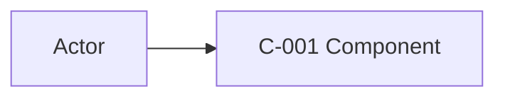
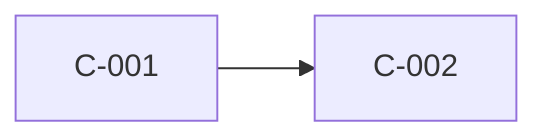
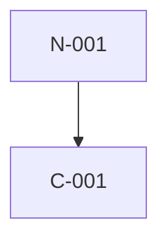

# Solution Architecture — Artifact Template

Load this file only during Stage 2 modeling and Stage 4 assembly. The JSON is
the structural source; Markdown carries rationale and human-readable
projections. Do not invent alternate filenames or fields.

## Directory

```text
docs/plans/<slug>/architecture/
├── solution-architecture.md
├── views.md
├── data-and-integrations.md
├── quality-attributes.md
└── architecture.json
```

## `architecture.json`

The example assumes `plan.json` contains `01-identity-foundation` and
`02-dashboard`, its Durable-State Closure owns `invitation`, and its TZ/IC
projections contain the referenced ids. Replace every hash placeholder and
render every plan-owned row; the linter never treats this as permission to omit
the rest of the source plan.

```json
{
  "schema_version": 1,
  "project_slug": "customer-portal",
  "status": "approved-with-gaps",
  "architecture_revision": 1,
  "source_plan_revision": 1,
  "source_plan_path": "docs/plans/customer-portal",
  "sources": [
    {
      "path": "docs/plans/customer-portal/plan.json",
      "sha256": "<64 lowercase hex>",
      "kind": "plan"
    },
    {
      "path": "docs/plans/customer-portal/architecture-selection.json",
      "sha256": "<64 lowercase hex>",
      "kind": "plan"
    },
    {
      "path": "docs/plans/customer-portal/feature-plan.md",
      "sha256": "<64 lowercase hex>",
      "kind": "plan"
    },
    {
      "path": "docs/plans/customer-portal/shared-context.md",
      "sha256": "<64 lowercase hex>",
      "kind": "plan"
    },
    {
      "path": "docs/plans/customer-portal/threat-model.md",
      "sha256": "<64 lowercase hex>",
      "kind": "plan"
    },
    {
      "path": "docs/plans/customer-portal/interaction-contract.md",
      "sha256": "<64 lowercase hex>",
      "kind": "plan"
    },
    {
      "path": "docs/plans/customer-portal/features/01-identity-foundation.md",
      "sha256": "<64 lowercase hex>",
      "kind": "plan"
    },
    {
      "path": "docs/plans/customer-portal/features/02-dashboard.md",
      "sha256": "<64 lowercase hex>",
      "kind": "plan"
    },
    {
      "path": "docs/briefs/customer-portal.md",
      "sha256": "<64 lowercase hex>",
      "kind": "brief"
    },
    {
      "path": "docs/adr/0001-application-runtime.md",
      "sha256": "<64 lowercase hex>",
      "kind": "adr"
    },
    {
      "path": "deploy/production.yaml",
      "sha256": "<64 lowercase hex>",
      "kind": "repository"
    }
  ],
  "artifacts": {
    "overview": "solution-architecture.md",
    "views": "views.md",
    "data_and_integrations": "data-and-integrations.md",
    "quality_attributes": "quality-attributes.md"
  },
  "coverage": {
    "system_context": {"status": "complete", "material": false, "reason": "actors and external systems traced"},
    "containers": {"status": "complete", "material": false, "reason": "runtime responsibilities traced"},
    "deployment": {"status": "gap", "material": false, "reason": "production region is not recorded"},
    "data": {"status": "complete", "material": false, "reason": "durable nouns and stores traced"},
    "integrations": {"status": "complete", "material": false, "reason": "cross-boundary flows traced"},
    "quality_attributes": {"status": "complete", "material": false, "reason": "plan NFRs mapped"},
    "security": {"status": "complete", "material": false, "reason": "TZ obligations re-projected"},
    "operability": {"status": "gap", "material": false, "reason": "alert ownership is unknown"},
    "requirements_traceability": {"status": "complete", "material": false, "reason": "every feature mapped"}
  },
  "components": [
    {
      "id": "C-001",
      "name": "Web application",
      "kind": "user-interface",
      "responsibilities": ["Serve the planned user journeys"],
      "features": ["02-dashboard"],
      "evidence_state": "recorded",
      "evidence": ["docs/plans/customer-portal/features/02-dashboard.md"]
    },
    {
      "id": "C-002",
      "name": "Portal application service",
      "kind": "service",
      "responsibilities": ["Authorize requests and own invitation state"],
      "features": ["01-identity-foundation", "02-dashboard"],
      "evidence_state": "recorded",
      "evidence": ["docs/plans/customer-portal/feature-plan.md"]
    }
  ],
  "relationships": [
    {
      "id": "R-001",
      "from": "C-001",
      "to": "C-002",
      "interaction": "Authenticated HTTPS API calls",
      "evidence_state": "recorded",
      "evidence": ["docs/plans/customer-portal/feature-plan.md"]
    }
  ],
  "deployment_nodes": [
    {
      "id": "N-001",
      "name": "Application runtime",
      "environment": "production",
      "evidence_state": "observed",
      "evidence": ["deploy/production.yaml"],
      "evidence_claims": {
        "name": {"path": "deploy/production.yaml", "literal": "kind: Deployment", "derivation": "Application runtime"},
        "environment": {"path": "deploy/production.yaml", "literal": "environment: production", "derivation": "production"}
      }
    }
  ],
  "deployments": [
    {
      "component_id": "C-001",
      "node_ids": ["N-001"],
      "evidence_state": "observed",
      "evidence": ["deploy/production.yaml"]
    }
  ],
  "data_entities": [
    {
      "id": "DATA-001",
      "name": "invitation",
      "data_class": "personal",
      "source_of_truth": "C-002",
      "writers": ["C-002"],
      "readers": ["C-001", "C-002"],
      "lifecycle": {
        "retain": "owned-by:02-dashboard",
        "export": "owned-by:02-dashboard",
        "erase": "owned-by:02-dashboard"
      },
      "plan_trace": "feature-plan.md#durable-state-closure",
      "features": ["02-dashboard"],
      "evidence_state": "recorded",
      "evidence": ["docs/plans/customer-portal/feature-plan.md"]
    }
  ],
  "integration_flows": [
    {
      "id": "IF-001",
      "producer": "C-001",
      "consumer": "C-002",
      "protocol": "HTTPS",
      "data": ["invitation command"],
      "data_entity_ids": ["DATA-001"],
      "source_of_truth": "C-002",
      "failure_behavior": "Caller receives an explicit failure; no success is implied",
      "plan_trace": "feature-plan.md#dependency-flow",
      "features": ["02-dashboard"],
      "contract_refs": ["TZ-001", "IC-001"],
      "evidence_state": "recorded",
      "evidence": ["docs/plans/customer-portal/interaction-contract.md"]
    }
  ],
  "quality_scenarios": [
    {
      "id": "QA-001",
      "attribute": "latency",
      "source": "docs/briefs/customer-portal.md",
      "stimulus": "A user submits an invitation",
      "environment": "normal load",
      "response": "The API confirms acceptance",
      "target": "p95 under 500 ms",
      "tactic": "Keep the synchronous path bounded",
      "verification": "/core-engineering:ce-probe-perf against the accepted criterion",
      "features": ["02-dashboard"],
      "evidence_state": "recorded"
    }
  ],
  "feature_mappings": [
    {
      "feature_id": "01-identity-foundation",
      "component_ids": ["C-002"],
      "data_ids": [],
      "integration_ids": [],
      "quality_ids": [],
      "architecture_disposition": "feature-local",
      "evidence_state": "inferred",
      "evidence": ["docs/plans/customer-portal/feature-plan.md"]
    },
    {
      "feature_id": "02-dashboard",
      "component_ids": ["C-001", "C-002"],
      "data_ids": ["DATA-001"],
      "integration_ids": ["IF-001"],
      "quality_ids": ["QA-001"],
      "architecture_disposition": "cross-feature",
      "evidence_state": "inferred",
      "evidence": ["docs/plans/customer-portal/feature-plan.md"]
    }
  ],
  "decisions": [
    {
      "id": "D-001",
      "status": "accepted",
      "summary": "Use the repository's existing application runtime",
      "adr_path": "docs/adr/0001-application-runtime.md",
      "features": ["01-identity-foundation", "02-dashboard"],
      "evidence_state": "recorded",
      "evidence": ["docs/adr/0001-application-runtime.md"]
    }
  ],
  "open_questions": [],
  "risks": [
    {
      "id": "AR-001",
      "statement": "External identity-provider limits are unverified",
      "owner": "architecture owner",
      "mitigation": "Confirm the provider contract before specification",
      "evidence_state": "recorded",
      "evidence": ["docs/briefs/customer-portal.md"]
    }
  ],
  "approval": {
    "decision": "approved-with-gaps",
    "recorded_by": "human",
    "gate": "Final Architecture Approval"
  }
}
```

Published-package values:

- `status`: `approved` or `approved-with-gaps`;
- coverage status: `complete`, `gap`, or `not-applicable`;
- coverage `material`: boolean; it is `true` only for a material gap, which
  blocks publication rather than being accepted under `approved-with-gaps`;
- component kind: `user-interface`, `service`, `worker`, `data-store`,
  `external-system`, or `platform`;
- `evidence_state`: `recorded`, `observed`, `inferred`, or `unknown`; every
  structural row carries one, and `unknown` must be represented by an explicit
  coverage gap in an `approved-with-gaps` package;
- deployment-node `evidence_claims`: exact `name` and `environment` selectors,
  each naming a path already in that node's `evidence` and a non-empty literal
  that occurs in that file, plus a `derivation` equal to the normalized node
  field. This makes the human-reviewed interpretation traceable; it does not
  mean the linter proved the selector semantically entails that interpretation;
- decision status: `accepted` only in a published package; unresolved choices
  stay in `open_questions` and block publication when material;
- `architecture_disposition`: `cross-feature` or `feature-local`.

Authoritative Markdown tables serialize ordered arrays with `, `, except
component `responsibilities` and integration-flow `data`, which use `; ` so
their item boundaries remain distinct from id lists. Render an empty array as
`—`. A row key is its exact JSON id (or component id for deployment rows), and
node selectors render as `<path> :: <literal>`. Do not add summary rows or
alternate keys: the linter requires the Markdown row set and every
review-significant cell to match `architecture.json` exactly.

The pre-approval scratch package alone uses `status: proposed` with
`approval.decision: pending` and `approval.recorded_by: pending`, and is linted
with `--allow-proposed`. Never publish that scratch posture.

Only a human-approved recovery from an existing package whose
`architecture.json` or revision is unreadable adds this durable field to the
scratch and resulting revision-1 package:

```json
"revision_reset": {
  "reason": "<non-empty human-approved reason>",
  "recorded_by": "human",
  "gate": "Invalid Architecture Package Recovery"
}
```

It is forbidden for a first package, a stale/current package, or an invalid
package whose prior revision is still readable. Publication additionally
requires the publisher's explicit reset flag.

All repository paths are root-relative. `sources` contains every file whose
change should make the package stale. Include at minimum the six plan-level
files, including `architecture-selection.json`, and every feature file. Include consumed briefs, ADRs, references, and
repository evidence as additional rows.

`data_entities` is the structural re-projection of the plan's Durable-State
Closure. Copy each durable noun's `data_class` and `retain` / `export` / `erase`
dispositions literally from its plan row, then map its components and features;
never assign a new class or lifecycle owner here. Flows use `data_entity_ids`
and feature mappings use `data_ids` so those references remain checkable.

## `solution-architecture.md`

```markdown
# Solution Architecture: <project-slug>

> Generated by `/core-engineering:ce-architecture`
> Status: approved | approved-with-gaps
> Source plan: `docs/plans/<slug>/` revision <n>
> Architecture revision: <n>
> Authority: architecture-baseline-only; no security acceptance, compliance attestation, release approval, or deployment authority.

## Executive Summary
## Scope and Non-Goals
## Architecture Drivers
| Driver | Evidence state | Source | Architecture consequence |
|---|---|---|---|

## Selected Direction Realization
| Exploration | Option | Selection binding | Realization summary | Evidence state | Evidence |
|---|---|---|---|---|---|

Emit exactly one row. Copy `Exploration` and `Option` from the validated plan
direction, render `Selection binding` exactly as
`<direction-status> / <selected-option-sha256-or-None>`, use `recorded`, and
cite exactly `docs/plans/<slug>/architecture-selection.json`. The realization
summary explains how the structural model implements that bound direction.

## Architecture Overview
## Decisions and Rationale
| Decision | Summary | Evidence state | Status | ADR | Affected features | Evidence |
|---|---|---|---|---|---|---|

## Feature Traceability
| Feature | Components | Data entities | Integration flows | Quality scenarios | Disposition | Evidence state | Evidence |
|---|---|---|---|---|---|---|---|

## Assumptions and Coverage Gaps
## Risks and Mitigations
| Risk | Statement | Evidence state | Owner | Mitigation | Evidence |
|---|---|---|---|---|---|
## Validation Strategy
## Evidence Boundary
```

Do not use this document to restate plan feature bodies, threat tables, or full
ADR text. Publication parks when deterministic lint cannot run, so a published
package never carries a manual-degraded validation posture.

## `views.md`

````markdown
# Architecture Views: <project-slug>

> Tables are authoritative. Mermaid diagrams are projections.

## System Context
| ID | Element | Kind | Responsibility | Evidence state | Evidence |
|---|---|---|---|---|---|



## Runtime / Container View
| Component | Name | Kind | Responsibilities | Features | Evidence state | Evidence |
|---|---|---|---|---|---|---|

| Relationship | From | To | Interaction | Evidence state | Evidence |
|---|---|---|---|---|---|



## Deployment View
| Node | Name | Environment | Name selector | Environment selector | Evidence state | Evidence |
|---|---|---|---|---|---|---|

| Component | Deployed to | Evidence state | Evidence |
|---|---|---|---|



## View Coverage Gaps
````

Never omit a view heading. When a view is `gap` or `not-applicable`, explain why
under that heading and keep the authoritative table shape.

## `data-and-integrations.md`

```markdown
# Data and Integrations: <project-slug>

## Data Ownership and Lifecycle
| ID | Durable noun / data set | Data class | Source of truth | Writers | Readers | Retain / Export / Erase | Plan trace | Features | Evidence state | Evidence |
|---|---|---|---|---|---|---|---|---|---|---|

## Integration Flows
| Flow | Producer | Consumer | Protocol / medium | Data | Data entities | Source of truth | Failure behavior | Contract refs | Plan trace | Features | Evidence state | Evidence |
|---|---|---|---|---|---|---|---|---|---|---|---|---|

## Flow Details
### IF-NNN — <name>

## Consistency, Idempotency, and Concurrency
## Security and Privacy Re-Projection
## Data and Integration Gaps
```

Data classes and `TZ-NNN` / `IC-NNN` ids are copied from their plan-owned
sources. Do not assign new ones here.

## `quality-attributes.md`

```markdown
# Quality Attributes: <project-slug>

## Quality Scenarios
| ID | Attribute | Evidence state | Source | Stimulus | Environment | Response | Target | Tactic | Verification | Features |
|---|---|---|---|---|---|---|---|---|---|---|

## QA-NNN — <scenario name>
## Operability and Observability
## Capacity, Resilience, and Recovery
## Cost and Complexity Trade-Offs
## Quality Coverage Gaps
```

A target is a requirement, not measured evidence. Use `unknown` when the source
contains no numeric or otherwise objectively decidable target, and route runtime
proof to the appropriate verification or probe workflow.
