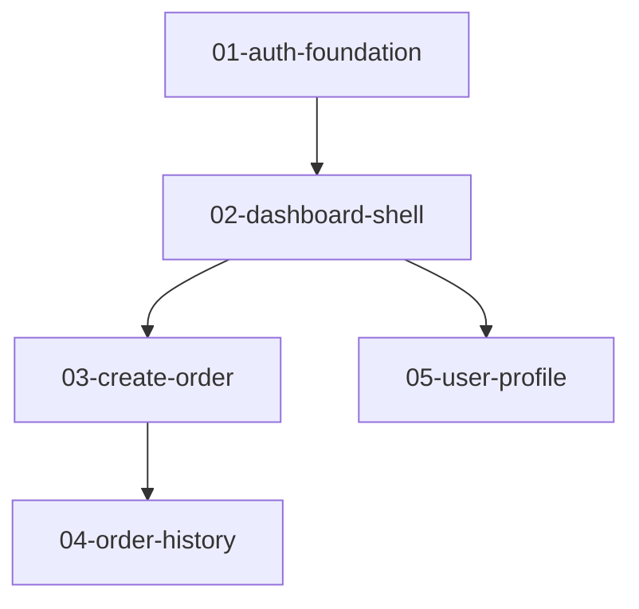

# Feature Plan — Artifact Template

Output structure, section templates, manifest schema, and tooling mapping for the
plan directory the plan skill writes, **plus the repo-level layer** every
plan in the repo shares. The skill loads this file at write time (Stage 9, or a
single-feature artifact accepted at the Sizing Gate).

---

## Repo-Level Layer

Some concerns are repo-wide, not plan-specific. They live outside any plan
directory so a second plan honors the same policy and sees the same decisions:

```text
docs/
├── adr/                  # repo-wide architectural decisions
└── plans/
    ├── plans.json        # registry of plans in this repo
    ├── vc-policy.md      # branching model, branch pattern, commit granularity
    ├── patterns.md       # repo-wide known pitfalls
    └── <slug>/           # per-plan directory (see Plan Directory Structure)
```

### `vc-policy.md`

The repo's version-control policy. Established once on the first
`/core-engineering:ce-implement` and honored by every plan thereafter. Shape:

```markdown
## VC Policy

| Field | Value |
|---|---|
| Repository | git |
| Branching model | feature-branch / trunk-based / manual |
| Branch pattern | feature/<plan-slug>/<id>  (default — multi-plan-safe) |
| Commit granularity | per-task / per-feature / none |
```

The default branch pattern includes `<plan-slug>` so two plans' `01-…` features
cannot collide. Users may pick `feature/<id>` at policy-establishment if they
prefer the simpler form on a single-plan repo.

### `plans.json` — plan registry

A slim index of every plan in this repo. Read by `/core-engineering:ce-spec` and `/core-engineering:ce-implement` to
resolve feature ids and disambiguate cross-plan matches; consulted by `/core-engineering:ce-plan` at
start to surface sibling plans for the related/unrelated decision.

```json
{
  "plans": [
    {
      "slug": "customer-portal",
      "description": "Customer support portal",
      "relates_to": []
    },
    {
      "slug": "admin-dashboard",
      "description": "Ops admin panel",
      "relates_to": ["customer-portal"]
    }
  ]
}
```

`relates_to` is one-directional, declared by the newer plan: this plan's specs
may read the named plans' Resolved Project Decisions ledger entries (presented
for human confirmation, never silently). Unrelated plans stay isolated. ADRs and
`patterns.md` are always shared across all plans, regardless of `relates_to`.

### Qualified feature ids — cross-plan references

In any **repo-level** artifact (ADR origin citations, ledger `Origin` cells,
`patterns.md` origin lines, cross-plan dependencies), refer to features in
their **qualified** form `<plan-slug>/<feature-id>` — e.g.
`customer-portal/03-user-profile`. Within a plan's own files (its `features/`,
`specs/`, `plan.json`), the unqualified id is fine.

A feature may declare a **cross-plan hard dependency** by listing a qualified
id in its `dependencies.hard`:

```yaml
dependencies:
  hard:
    - id: customer-portal/01-auth-foundation
      reason: …
```

`spec` Stage 0.2 (enforce dependency order) resolves qualified ids
against the referenced plan's `specs/` or its built code, and stops if the
dependency is neither specced nor built.

---

## Plan Directory Structure

A multi-feature plan is written as a **directory**, not a single file, so a
downstream skill can load one feature without reading the whole plan:

```text
docs/plans/[project-slug]/
├── feature-plan.md       # index — orientation and human review
├── shared-context.md     # context every downstream feature spec needs
├── threat-model.md       # trust boundaries + data-classes + per-feature security obligations
├── interaction-contract.md  # cross-feature protocol invariants + architecture-determining NFRs (read-only re-projection)
├── features/
│   ├── 01-<slug>.md      # one full feature block per feature
│   ├── 02-<slug>.md
│   └── …
└── plan.json             # machine-readable manifest
```

Each section template in **Section Details** below belongs to exactly one file.
Place it per this map:

| File | What it contains |
|---|---|
| `feature-plan.md` | 1 Overview · 2 Project Context · 4 Decomposition Q&A · 5 Why This Split · 8 Journey Map / Consumability Trace · 9 Journey Bridges by Feature · 10 Dependency Flow · Feature Table · 12 Execution Checklist · 13 Notes · 14 Tooling Mapping |
| `shared-context.md` | 3 Codebase Profile · 6 Project Docs · 7 Known Pitfalls · Resolved Project Decisions |
| `threat-model.md` | Threat Model (Trust Boundaries · Secrets & Data-Classes · Exposure Surface · Per-Feature Security Obligations) — a read-only re-projection of §3 / §6.3 / §7.5; see *Threat Model* below |
| `interaction-contract.md` | Interaction Contract (Behavioural-Protocol Invariants · Architecture-Determining NFRs · Per-Feature Interaction Obligations) — a read-only re-projection of §3 / §8 Journey Map / §10 Dependency Flow / §6.3 durable nouns (multi-toucher set derived via §8 / §10) / §2–§4 cited NFRs; see *Interaction Contract* below |
| `features/<id>.md` | one copy of the 11 Features block, per feature |
| `plan.json` | the manifest (see Plan Manifest below) |

`feature-plan.md` must **not** inline the per-feature blocks — it carries only the
compact Feature Table and links to `features/<id>.md`. For a single-feature plan
accepted at the Sizing Gate, use **Recommended Minimal Output** instead — one
file, no directory.

---

## Section Details

### 1. Overview

Write a 2–3 sentence project summary.

Include:

- what is being built or changed
- who it is for
- what the decomposition is optimized for

---

### 2. Project Context

Include the original project description verbatim.

```markdown
## Project Context

### Original Project Description

> [verbatim project description]
```

---

### 3. Codebase Profile

Include the structured profile from Stage 1.2.

Recommended format:

```yaml
codebase_profile:
  stack:
    language:
    framework:
    package_manager:
    manifest_path:              # where new deps are declared (package.json / pyproject.toml / requirements.txt)
    registry_query_command:     # confirms a package exists (e.g. `npm view {pkg}` / `pip index versions {pkg}`) — dep-existence check
    build_system:
  public_interaction_surfaces:
    ui_routes:
    api_endpoints:
    cli_commands:
    exported_functions:
    webhook_handlers:
  data_surfaces:
    persistence_style:
    tables_or_collections:
    migration_mechanism:
    event_schemas:
  integration_boundaries:
    - 
  cross_cutting_layers:
    - 
  convention_density:
  hot_files:
    - 
  baseline_delivery_health:
    working_tree:
    build_command:
    test_command:
    lint_or_typecheck_command:
    ci_configured:
    deployment_target:
  brownfield_friction:
    tier:
    reason:
```

---

### Threat Model — `threat-model.md`

A per-plan, **read-only re-projection** assembled at write time from the **§3
Codebase Profile** (artifact section — trust boundaries / exposure), the **plan
Stage-6.3 Durable-State Closure** (data-classes), and the **plan Stage-7.5**
security / secrets Boundary-Owner. (The `§6.3` / `§7.5` are *plan stage* numbers,
distinct from this artifact's own §1–§14 sections.) It is the
security context `/core-engineering:ce-spec` derives `[SECURITY]` criteria from, and `/core-engineering:ce-review`,
`/core-engineering:ce-probe-sec`, and `/core-engineering:ce-verify` read. **It never re-assigns a data-class** — the §6.3
closure owns that (assigned once, human-attested); the threat model only
re-projects it, so the two can never drift.

**Threat-id assignment is *surface, don't force*:** a feature earns a `TZ-NNN`
(zero-padded, house style) when it **crosses a trust boundary** — owns / exposes a
public interaction surface, or integrates across an auth / external-API / payment /
object-store boundary — **or is the security / secrets Boundary-Owner**. A feature
that *only owns* a `sensitive` / `personal` noun with no boundary of its own carries
an **advisory note**, never a forced threat_id. Assignment is **model-derived,
human-confirmed at the Stage 8 Final Review** (the same posture as the data-class).

````markdown
# Threat Model: <plan-slug>

> Generated by /core-engineering:ce-plan — a READ-ONLY re-projection of §3 Codebase
> Profile + §6.3 Durable-State Closure (data-classes) + §7.5 security/secrets owner.
> Consumed by /core-engineering:ce-spec (derives [SECURITY: TZ-NNN] criteria), /core-engineering:ce-review, /core-engineering:ce-probe-sec, /core-engineering:ce-verify.
> Data-classes are owned by the §6.3 closure and never re-assigned here.

## Trust Boundaries
| Boundary | Entry point / surface | Untrusted input | Auth required | Source |
|---|---|---|---|---|
| public HTTP API | `POST /orders` | client body | bearer token | profile.public_interaction_surfaces |
| payment gateway | Stripe API (outbound) | — | API key (secret) | profile.integration_boundaries |

## Secrets & Data-Classes   *(read-only re-projection of §6.3 — never re-assigned here)*
| Durable noun | Data-class | Owning feature | Governance dispositions |
|---|---|---|---|
| `credential` | sensitive | 02-auth | retain owned-by:02-auth · export excluded · erase owned-by:09-account |

## Exposure Surface
| Surface | Externally reachable | Notes |
|---|---|---|
| `POST /orders` | yes | authenticated |

## Per-Feature Security Obligations
The machine-readable block `/core-engineering:ce-spec`'s Security Criteria (and a later spec-lint H5
check) read. One entry per feature; `threat_ids` empty ⇒ no obligation (an
`advisory` may still note a sensitive noun with no boundary).

```yaml
security_obligations:
  - feature: 03-checkout
    threat_ids: [TZ-001, TZ-002]
    surface_kinds: [authz, validation]   # injection | authz | secrets | validation
  - feature: 05-profile
    threat_ids: []
    advisory: "owns `sensitive` noun `credential` with no boundary of its own — consider a security criterion"
```
````

**No-Security-Surface negative.** When **none** of the four detection conditions
hold across the plan, write `threat-model.md` with the section below *in place of*
the four above — an explicit attested negative, **never a silent skip** (the same
discipline as §6.4 `N/A` and the Interface-Foundation consented exception):

````markdown
## No Security Surface

This plan has no detected security surface. All four conditions checked, each absent:
- no auth/authz or secrets-management cross-cutting layer (§3 profile.cross_cutting_layers)
- no auth-provider / external-API / payment / object-store integration boundary (§3 profile.integration_boundaries)
- no `personal` / `sensitive` durable noun (§6.3 closure)
- no security / secrets Boundary-Owner assigned (§7.5)

```yaml
security_obligations: []
```
````

---

### Interaction Contract — `interaction-contract.md`

A per-plan, **read-only re-projection** assembled at write time from the **§3
Codebase Profile** (`integration_boundaries` / `data_surfaces` /
`public_interaction_surfaces` / `cross_cutting_layers` — the protocol *substrate*),
the **§8 Journey Map / Consumability Trace (plan Stage 6) + §10 Dependency Flow** (the
producer→consumer *edges*), and the **plan Stage-6.3 Durable-State Closure** (the
durable nouns *touched by more than one feature*). (The `§6.3` is a *plan stage*
number, distinct from this artifact's own §1–§14 sections.) It is the cross-feature
behavioural context `/core-engineering:ce-spec` derives `[CONTRACT: IC-NNN]` criteria from, and `/core-engineering:ce-review`
and `/core-engineering:ce-verify` read. It pins the **protocol guarantees of an edge the plan already
traced** so a producer and consumer cannot silently disagree (delivery / ordering /
idempotency / retry / concurrency), and the **numbers that shaped the decomposition**
(architecture-determining NFRs).

**It owns nothing the layers below own.** It is **keyed on an edge it does not own** —
the Journey Map (§8) and Dependency Flow (§10) own the edge set; this contract only
attaches the protocol *values* to an edge they already trace, never enumerating or
re-deciding an edge. It **never re-assigns a data-class** (the §6.3 closure owns that,
assigned once, human-attested) and **never re-cuts a feature boundary** (the
decomposition owns that); it only adds the multi-toucher concurrency/idempotency
posture §6.3 does not capture and the protocol residue of an async edge — so the two
can never drift.

**Surface, don't force.** A **Behavioural-Protocol Invariant** row exists only for an
already-traced cross-feature edge crossing an **async / durable medium** (event-bus /
queue / external-API / shared-store — a synchronous in-process call has no protocol
residue and earns no row), or for a §6.3 durable noun **touched by >1 feature**. An
**Architecture-NFR** row exists only for a numeric target the plan **literally cited**
in §2 / §3 / §4 (Decomposition Q&A — incl. a brief's success criteria / constraints) *and* that **demonstrably shaped the cut** (forced a split, a boundary, an
async edge, a separate worker) — never a general perf target, never a number the plan
never stated. The `IC-NNN` ids (zero-padded, house style; **one shared id space across
both tables**) are **model-derived, human-confirmed at the Stage 8 Final Review** (the
same posture as the data-class and the `TZ-NNN`).

````markdown
# Interaction Contract: <plan-slug>

> Generated by /core-engineering:ce-plan — a READ-ONLY re-projection of §3 Codebase
> Profile + §8/§10 cross-feature edges + §6.3 durable nouns (multi-toucher via §8/§10) + §2/§3/§4 cited NFRs.
> Consumed by /core-engineering:ce-spec (derives [CONTRACT: IC-NNN] criteria), /core-engineering:ce-review, /core-engineering:ce-verify.
> Edges are owned by the §8 Journey Map / §10 Dependency Flow; data-classes by the §6.3
> closure; feature boundaries by the decomposition — none re-assigned here.

## Behavioural-Protocol Invariants
One row per already-traced cross-feature producer→consumer EDGE on an async/durable
medium, or per §6.3 durable noun touched by >1 feature. The edge is owned upstream;
this table only pins its protocol guarantees.

| IC-NNN | Edge / shared noun | Medium | Idempotency | Delivery | Ordering | Retry/Timeout | Concurrency | Producer / Consumer |
|---|---|---|---|---|---|---|---|---|
| IC-001 | 02-orders → 05-fulfilment (`order.placed`) | event-bus | consumer dedupes on `order_id` | at-least-once | per-`order_id` ordered | producer retries 3× backoff; consumer tolerates replay | — | 02-orders / 05-fulfilment |
| IC-002 | shared noun: `inventory_row` | shared-store | decrement idempotent per `reservation_id` | — | — | — | optimistic-lock on `version` | 04-cart (write) / 05-fulfilment (write) |

## Architecture-Determining NFRs
One row only for a numeric target the plan cited (§2 / §3 / §4) AND that shaped the cut.
`Source` must point at the literal text; an unstated number is not invented here.

| IC-NNN | NFR | Target | Source | Shapes (the decomposition consequence) | Owning feature(s) |
|---|---|---|---|---|---|
| IC-003 | throughput | 10k msg/s | §2 project description | forced async order pipeline → 05-fulfilment split from 02-orders | 02-orders, 05-fulfilment |

## Per-Feature Interaction Obligations
The machine-readable block `/core-engineering:ce-spec`'s Interaction-Contract Criteria read. One entry per
feature; `ic_ids` empty ⇒ no obligation (an `advisory` may still note a single-toucher
shared noun or a stated-but-non-shaping NFR).

```yaml
interaction_obligations:
  - feature: 05-fulfilment
    ic_ids: [IC-001, IC-003]
    kinds: [idempotency, ordering, throughput]   # idempotency | delivery | ordering | retry | concurrency | latency | throughput | tick-rate
  - feature: 09-reporting
    ic_ids: []
    advisory: "reads `inventory_row` but is the only toucher — no cross-feature concurrency obligation"
```
````

**No-Cross-Feature-Protocol negative.** When **none** of the four detection conditions
hold across the plan, write `interaction-contract.md` with the section below *in place
of* the tables above — an explicit attested negative, **never a silent skip** (the same
discipline as §6.4 `N/A` and the No-Security-Surface negative):

````markdown
## No Cross-Feature Protocol

This plan has no detected cross-feature protocol or architecture-determining NFR. All
four conditions checked, each absent:
- no event / queue / external-API integration boundary carrying a cross-feature edge (§3 profile.integration_boundaries / data_surfaces.event_schemas)
- no §8 Journey-Map / §10 Dependency-Flow edge that crosses between two features over a durable/async medium
- no §6.3 durable noun touched by >1 feature
- no architecture-determining numeric target (latency / throughput / concurrency / tick-rate) cited in §2 / §3 / §4 as a decomposition driver

```yaml
interaction_obligations: []
```
````

---

### 4. Decomposition Q&A

Record Q/A pairs verbatim.

```markdown
| # | Question | Answer |
|---:|---|---|
| 1 | ... | ... |
```

---

### 5. Why This Split

Explain why these feature boundaries were chosen.

Include:

- primary slicing method
- validation methods used
- why alternatives were rejected
- how foundation features unlock later work
- how reachability/consumability is preserved

---

### 6. Project Docs

List project-wide reference docs.

If none:

```markdown
None
```

If docs exist:

```markdown
- `docs/architecture.md`
- `docs/api-contract.md`
- `design/system.md`
```

---

### 7. Known Pitfalls

List seeded pitfalls or write:

```markdown
None supplied.
```

If pitfalls were added to `patterns.md`, mention the path.

---

### Resolved Project Decisions

A ledger of cross-feature decisions resolved downstream by
`/core-engineering:ce-spec`. It is **empty when the plan is written** — specs append
to it as they resolve unknowns that affect more than one feature, so every later
spec reads it before re-deciding anything.

Write the section into `shared-context.md` with a placeholder:

```markdown
## Resolved Project Decisions

_None yet — populated by `/core-engineering:ce-spec` as cross-feature unknowns are resolved._
```

Specs append rows in this shape:

```markdown
| # | Decision | Resolution | Origin | Detail |
|---|---|---|---|---|
| RPD-1 | Which identity provider for admin login? | Okta | spec customer-portal/03-user-profile | ADR-0007 |
| RPD-2 | Are failed imports retryable? | Yes — retryable with backoff | spec customer-portal/05-bulk-import | (inline) |
```

Architecturally-significant decisions cite their ADR in **Detail**;
non-architectural ones state the full resolution and mark **Detail** `(inline)`.

---

### 8. Journey Map or Consumability Trace

Use UI Journey Map for UI projects; Consumability Trace for backend/API/CLI/SDK/worker/infrastructure.

Each journey is **testable-by-design**. Record, per journey, a **primary verification modality** (the dominant tool class), and per step the `Step | Surface | Owned By | Reachability | Modality | Expected observable` columns (see plan Stage 6) — a step names its own modality when it crosses to another surface. The expected observable is outcome-level (what the user/consumer sees — rendered confirmation, status code, exit code, persisted row, emitted event), not test mechanics; `spec` derives the concrete test cases from it and carries each step's modality onto them. Modality vocabulary: `browser · http · cli · sdk · event · iac · db · manual` (extend as needed).

```markdown
**Journey: <name>**  ·  primary modality: <browser | http | cli | sdk | event | iac | db | manual>

| Step | Surface | Owned By | Reachability | Modality | Expected observable |
|---|---|---|---|---|---|
| … | … | … | … | … | … |
```

**Durable-State Closure (plan Stage 6.3).** For each durable noun any journey writes
(a step with modality `db`, or `event` / `iac` against a persisted target — see gate §6.3.1),
record its access-mode and the disposition of its three reciprocals:

| Noun | Access-mode | Data-class | revisit | amend | retire | retain | export | erase |
|---|---|---|---|---|---|---|---|---|
| <noun> | user-owned-mutable / system-or-append-only | personal / sensitive / operational | owned-by:<id> / bridge:… / excluded:<reason> | … | … | … | … | … |

Reciprocals dispositioned `excluded` are recorded in Notes (§13) with their reason.

**Surface-Removal Closure (plan Stage 6.4 — brownfield only).** For each existing
shipped public surface (from the Stage 1.2 codebase profile) any feature's scope
removes, renames, or incompatibly changes, record its break-class and the
disposition of its continuity obligation:

| Surface | Break-class | continuity |
|---|---|---|
| <route / signature / event / flag / config key> | contract-break / internal-only | deprecate:<window>,removed_by:<id> / shim:<desc>,owned-by:<id> / hard-break:<reason> |

Surfaces dispositioned `hard-break` are recorded in Notes (§13) with their reason
and blast radius. A greenfield plan records this `N/A`.

If a journey is deferred, record it in Notes.

---

### 9. Journey Bridges by Feature

List only features that ship bridges.

If no bridges:

```markdown
N/A
```

Bridge block format:

```yaml
feature: 02-create-order
bridges:
  - type: exit
    description: "Show temporary order-submitted page until order history exists."
    replaces: "Missing order history return surface"
    replaced_by: "04-order-history"
```

---

### 10. Dependency Flow

Use ASCII or Mermaid.

ASCII example:

```text
01-auth-foundation
   |
   v
02-dashboard-shell
   |
   +--> 03-create-order
   |        |
   |        v
   |    04-order-history
   |
   +--> 05-user-profile
```

Mermaid example:



---

### 11. Features

Write **one file per feature** at `features/<id>.md`, where `<id>` is the stable
feature slug. Each file contains exactly this block:

````markdown
## 01-feature-slug

**Title:** Human-readable feature title  
**Type:** foundation | user-facing | integration | infrastructure | refactor | enabling  
**Description:** Short explanation of what this feature delivers.

### Structured Metadata

```yaml
id: 01-feature-slug
title:
type:
status: planned
priority:
owner:
intrinsic_complexity:
brownfield_adjusted_complexity:
final_complexity:
risk_profile:
boundary_owner:
reviewer_triggers:
dependencies:
  hard:
    - id:
      reason:
  soft:
    - id:
      reason:
      bridge_required:
open_unknowns:
  - 
```

### Sizing

| Signal | Value |
|---|---|
| Public interaction surfaces | |
| Data surfaces | |
| Integration boundaries | |
| Cross-cutting concerns | |
| Fits one implementation session | yes/no |
| Session-fit disposition | standard / consented-coarsened |
| Brownfield friction applied | yes/no |
| Reviewer trigger count | |
| Final Complexity | |

### Scope

- 

### Excluded

- 

### Public / Data / Integration Surfaces

Public interaction surfaces:

- 

Data surfaces:  *(tag each persisted noun `[user-owned-mutable]` or `[system-or-append-only]` **and** `[personal]` / `[sensitive]` / `[operational]` — the access-mode + data-class that drive Stage 6.3 closure)*

- 

Integration boundaries:

- 

### Dependencies

Hard dependencies:

- 

Soft dependencies:

- 

### Unlocks

- 

### Journey / Consumability Impact

- 

### Open Unknowns

- 

### Validation Target

This feature is ready for downstream specification when the spec can define how to verify:

- 

### Run

```bash
/core-engineering:ce-spec 01-feature-slug
```
````

---

### Feature Table

`feature-plan.md` lists every feature in one compact table — no full blocks. The
full detail lives in each `features/<id>.md`.

```markdown
| # | Feature | Type | Final Complexity | Risk | Hard Deps | File |
|---:|---|---|---|---|---|---|
| 1 | 01-auth-foundation | foundation | Moderate | low | — | `features/01-auth-foundation.md` |
| 2 | 02-dashboard-shell | user-facing | Simple | low | 01-auth-foundation | `features/02-dashboard-shell.md` |
```

---

### 12. Execution Checklist

One checkbox per feature in ship order.

```markdown
- [ ] 01-auth-foundation
- [ ] 02-dashboard-shell
- [ ] 03-create-order
```

---

### 13. Notes

Include:

- deferred journeys
- high-risk feature justifications
- accepted bridge trade-offs
- explicit user overrides
- known limitations
- assumptions made during planning
- durable-noun reciprocals excluded by design (with reason) — usability (revisit / amend / retire) **and** governance (retain / export / erase), each named
- any durable-noun data-class downgrade (`personal` → `operational`) or upgrade (`personal` → `sensitive`), with reason
- existing surfaces hard-broken by design (with reason and blast radius)
- the light-plan tier and its merged gates when `plan_tier: light` — a `plan-tier: light` entry naming what folded (Candidate Decision → Final Approval, and the combined §8.2.3 attestation when it fired)

---

### 14. Tooling Mapping

Only when the user named a target tool: emit a short `## Tooling Mapping` section naming the tool, mapping each plan field — Feature ID, Type, Final Complexity, Risk-Profile, Boundary-Owner, Dependencies, Open-Unknowns, Validation Target — to its counterpart in that tool (Azure DevOps, Jira, GitHub Issues, Linear, …). Omit the section when no target tool is named.

---

## Machine-Readable Feature Schema

Use this schema as the canonical feature metadata shape inside the Markdown artifact.

```yaml
id: string
title: string
type: foundation | user-facing | integration | infrastructure | refactor | enabling
status: planned
priority: low | medium | high | critical | unknown
owner: string | unassigned
description: string

sizing:
  public_interaction_surfaces:
    count: number
    examples:
      - string
  data_surfaces:
    count: number
    examples:
      - string
  integration_boundaries:
    count: number
    examples:
      - string
  cross_cutting_concerns:
    count: number
    examples:
      - string
  fits_one_implementation_session: true | false
  session_fit: standard | consented-coarsened   # consented-coarsened ⇒ a Stage-5.5 Coarsening Lease kept this feature oversized by user consent
  intrinsic_complexity: Simple | Moderate | Complex
  brownfield_adjusted_complexity: Simple | Moderate | Complex
  reviewer_trigger_count: number
  final_complexity: Simple | Moderate | Complex

risk:
  profile: low | medium | high
  reason: string
  high_risk_justification: string | null

boundary_owner:
  categories:
    - security | secrets | persistence | i18n | accessibility | design-system   # + interface-foundation categories on demand (e.g. api-contract for http)
  reason: string | null

scope:
  in:
    - string
  out:
    - string

dependencies:
  hard:
    - id: string
      reason: string
  soft:
    - id: string
      reason: string
      bridge_required: true | false

bridges:
  - type: entry | exit | consumer | operational
    description: string
    replaces: string
    replaced_by: string

unlocks:
  - id: string
    reason: string

open_unknowns:
  - string

validation_target:
  - string

run:
  command: string
```

---

## Plan Manifest (`plan.json`)

`plan.json` is the machine-readable index of the plan. It lets a downstream
skill resolve feature files, ship order, and the dependency graph without
parsing Markdown.

```json
{
  "project_slug": "customer-support-portal",
  "status": "planned",
  "plan_revision": 1,
  "plan_tier": "standard",
  "relates_to": [],
  "features": [
    {
      "id": "01-auth-foundation",
      "title": "Authentication foundation",
      "type": "foundation",
      "final_complexity": "Moderate",
      "risk_profile": "low",
      "ship_order": 1,
      "file": "features/01-auth-foundation.md",
      "dependencies": { "hard": [], "soft": [] }
    }
  ]
}
```

The `features` array is in ship order. Every `file` path is relative to the plan
directory and must point to an existing `features/<id>.md`.

### `plan_revision` — the revision counter

`plan_revision` is a monotonically increasing integer stamped on every write.
The **first written plan is revision `1`** (an **absent** key is read as `1`, so a
plan written before this key existed needs no migration). Each `/core-engineering:ce-plan` **Stage R**
revision (SKILL.md Execution Contract item 17) bumps it by one and appends a
`plan-revision <N>` entry to Notes (§13) recording what changed, which gates re-ran,
and which were held. A touched feature's `features/<id>.md` Structured-Metadata block is
stamped `revised_by: plan-revision <N>` — the signal that its `specs/<id>/` (if any) is
now stale and its `/core-engineering:ce-spec` must be re-run. Untouched features keep no such stamp and
their specs are preserved byte-for-byte.

### `plan_tier` — which gate set ran

`plan_tier` is `standard` (default) or `light`. An **absent** key reads as `standard`, so a
plan written before this key existed needs no migration. It is written `light` only when the
run entered the **light-plan tier** (SKILL.md Execution Contract item 18 · stage-4-7-gates.md
§4.3) — a ≤ 3-feature plan with no contested Boundary-Owner and no `sensitive` data-class —
and did **not** expand back to the full gates at 8.3. In the light tier the standalone
Candidate Decision (§5.4) folds into Final Approval and, when both read-only re-projections
resolve negative, the 8.2.1 + 8.2.2 attestations combine into one (§8.2.3); the correctness
gates (Reachability §6, Session-Fit §7) still run in full. The key lets `/core-engineering:ce-plan-audit` and a
later **Stage R** read the merged-gate set from the artifact rather than re-deriving which
gates fired. A matching `plan-tier: light` entry in Notes (§13) names the merged gates in
prose. `light` is only ever written for a multi-feature directory plan — a single-feature
minimal plan has no `plan.json` to carry the key.

---

## Recommended Minimal Output for Very Small Projects

If the Sizing Gate recommends a single-feature plan and the user accepts, skip the directory structure and write a single simplified file — `docs/plans/[project-slug]/feature-plan.md` — with:

1. Overview
2. Project Context
3. Codebase Profile
4. Single Feature
5. Validation Target
6. Execution Checklist
7. Notes

The single feature should still include:

- `Feature ID: <id>` on its own line, using the same stable, unqualified id
  convention as a full plan's `features/<id>.md` (for example
  `Feature ID: 01-health-check`);
- final Complexity
- Risk-Profile
- Scope
- Excluded
- Open-Unknowns
- Validation Target
- exactly one qualified downstream run line whose slug and id match the
  registry entry and `Feature ID`, for example
  `Run: /core-engineering:ce-spec service-health/01-health-check`. Never emit an
  unqualified run line for this shape: the pair is the machine-readable handoff
  that lets `/core-engineering:ce-spec` resolve a plan with no `plan.json` or
  `features/` directory.

`Feature ID` and the qualified `Run` line are durable identity fields, not
display prose. They must agree exactly and may change only through an explicit
plan revision; a title or heading is not a substitute for either field.

The `## 6. Execution Checklist` must contain exactly one implementation checkbox
keyed by that same id, for example
`- [ ] 01-health-check — implemented and verified`. `/core-engineering:ce-implement`
ticks that existing row after acceptance; it never guesses which checkbox owns
the feature or appends a replacement row.

**No `threat-model.md` / `interaction-contract.md`.** The single-feature minimal output deliberately omits both read-only re-projections: a one-feature plan has no cross-feature edge, no durable noun touched by >1 feature, and no cross-boundary surface *by construction*, so the *No Security Surface* / *No Cross-Feature Protocol* attested-negatives are satisfied by the directory shape itself — not a silent omission. If the lone feature later grows a real security or cross-feature surface, that is a Sizing-Gate re-evaluation into a full multi-feature plan, which writes both files.

---


## Practical Tooling Field Mapping

| Workflow Field | Azure DevOps | Jira | GitHub Issues | Linear |
|---|---|---|---|---|
| Feature ID | Title prefix | Issue key/title prefix | Issue title prefix | Issue title prefix |
| Type | Work item type / tag | Issue type / label | Label | Label |
| Scope | Description | Description | Body | Description |
| Excluded | Description section | Description section | Body section | Description section |
| Final Complexity | Story points / custom field | Story points / custom field | Label / project field | Estimate |
| Risk-Profile | Custom field / tag | Custom field / label | Label | Label |
| Boundary-Owner | Tag | Component / label | Label | Label |
| Dependencies | Predecessor/successor links | Issue links | Linked issues | Relations |
| Open-Unknowns | Checklist / comments | Checklist / comments | Task list | Comments / sub-issues |
| Validation Target | Acceptance criteria seed | Acceptance criteria seed | Checklist | Checklist |
| Execution Checklist | Delivery checklist | Epic checklist | Project board | Project milestones |
